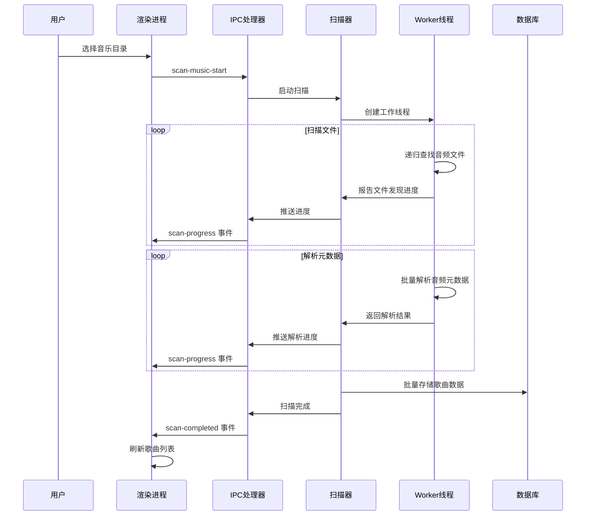

# LLMusic 本地音乐播放器 - 技术文档

## 项目概述

LLMusic 是一个基于 Electron + Vue.js 3 构建的跨平台桌面音乐播放器，专注于本地音乐文件的管理和播放。项目采用现代化的技术栈和最佳实践，提供流畅的用户体验和强大的功能。

### 核心特性

- 🎵 支持多种音频格式 (MP3, FLAC, WAV, M4A, OGG, AAC)
- 📁 多音乐库管理
- 🎤 LRC 歌词同步显示
- 🖼️ 专辑封面展示
- 📱 系统媒体控制集成
- 🔍 智能搜索和过滤
- 📋 自定义播放列表
- ⚡ 虚拟滚动优化大列表性能

## 技术栈

### 核心框架

- **Electron** `^36.5.0` - 跨平台桌面应用框架
- **Vue.js 3** `^3.5.16` - 前端框架，使用 Composition API
- **Pinia** `^3.0.3` - 状态管理库
- **Vite** `^6.3.5` - 现代前端构建工具

### 数据存储

- **lowdb** `^7.0.1` - 基于 JSON 文件的轻量级数据库
- **music-metadata** `^11.2.3` - 音频文件元数据解析

### 音频处理

- **fluent-ffmpeg** `^2.1.3` - FFmpeg Node.js 包装器
- **ffmpeg-static** `^5.2.0` - FFmpeg 静态二进制文件
- **ffprobe-static** `^3.1.0` - FFprobe 静态二进制文件

### UI 增强

- **vue-virtual-scroller** `^2.0.0-beta.8` - 虚拟滚动组件
- **SCSS** `^1.89.2` - CSS 预处理器

### 开发工具

- **concurrently** `^8.2.2` - 并行运行命令
- **electron-builder** `^26.0.12` - 应用打包工具

## 项目架构

### 目录结构

```
music/
├── src-main/                 # Electron 主进程
│   ├── main.js              # 应用入口
│   ├── database.js          # 数据库模块
│   ├── musicScanner.js      # 音乐扫描引擎
│   ├── preload.js           # 安全 API 暴露
│   ├── audioProcessor.js    # 音频处理服务
│   ├── lyricsParser.js      # 歌词解析器
│   ├── scannerWorker.js     # 扫描工作进程
│   ├── ipc-handlers/        # IPC 处理模块
│   │   ├── index.js         # 统一注册
│   │   ├── windowHandlers.js # 窗口控制
│   │   ├── scanHandlers.js   # 扫描处理
│   │   ├── songHandlers.js   # 歌曲处理
│   │   ├── playlistHandlers.js # 播放列表
│   │   └── libraryHandlers.js # 音乐库管理
│   ├── utils/               # 工具模块
│   │   ├── throttle.js      # 节流函数
│   │   ├── lruCache.js      # LRU 缓存
│   │   └── ipcWrapper.js    # IPC 封装
│   └── constants/
│       └── ipcChannels.js   # IPC 通道常量
├── src-renderer/            # Vue 渲染进程
│   ├── main.js              # Vue 应用入口
│   ├── App.vue              # 根组件
│   ├── components/          # Vue 组件
│   │   ├── SideBar.vue      # 侧边栏
│   │   ├── MainContent.vue  # 主内容区
│   │   ├── PlayerBar.vue    # 播放器控制栏
│   │   ├── LyricPage.vue    # 歌词页面
│   │   ├── Settings.vue     # 设置页面
│   │   └── ...              # 其他组件
│   ├── store/               # Pinia 状态管理
│   │   ├── media.js         # 媒体库状态
│   │   ├── player.js        # 播放器状态
│   │   ├── playlist.js      # 播放列表状态
│   │   └── ui.js            # UI 状态
│   ├── assets/              # 静态资源
│   │   └── icons.js         # SVG 图标集合
│   └── styles/              # 样式文件
├── package.json             # 项目配置
├── vite.config.js          # Vite 配置
└── build.bat               # Windows 打包脚本
```

## 核心模块详解

### 主进程架构 (src-main/)

#### 1. 应用入口 (main.js)

**功能概述**: Electron 应用的主入口点，负责整个应用的生命周期管理

**核心功能**:

- **窗口管理**: 创建和配置 BrowserWindow，设置窗口尺寸、标题栏隐藏等
- **托盘集成**: 创建系统托盘图标，支持最小化到托盘功能
- **应用状态管理**: 维护全局应用状态 (mainWindow, tray, closeWindowBehavior)
- **安全策略**: 设置内容安全策略 (CSP) 防止 XSS 攻击
- **生命周期处理**: 处理应用启动、激活、退出等事件

**关键方法**:

- `createWindow()`: 创建主窗口，配置开发/生产环境加载路径
- `createTray()`: 创建系统托盘，设置右键菜单
- `initializeApp()`: 应用初始化流程，按序执行各模块初始化
- `setupContentSecurityPolicy()`: 配置安全策略

#### 2. 数据库模块 (database.js)

**功能概述**: 基于 lowdb 的数据持久化层，提供高性能的数据存储和查询

**核心功能**:

- **JSON 数据库**: 使用 lowdb 管理 JSON 文件数据库
- **内存索引**: songById 和 songByPath Map 提供 O(1) 查询性能
- **数据完整性**: 文件验证、数据迁移、索引重建
- **缓存机制**: LRU 缓存最近访问的歌曲元数据 (最多 200 首)

**数据结构**:

```javascript
{
  songs: [],      // 歌曲数组
  libraries: [],  // 音乐库数组
  playlists: [],  // 播放列表数组
  settings: {}    // 应用设置
}
```

**关键方法**:

- `initDb()`: 初始化数据库，构建内存索引
- `parseSongFromFile()`: 从音频文件解析元数据
- `getSongById()` / `getSongsByLibrary()`: 高性能歌曲查询
- `validateSongFiles()`: 验证歌曲文件有效性
- `rebuildIndices()`: 重建内存索引

#### 3. 音乐扫描引擎 (musicScanner.js)

**功能概述**: 高性能音乐文件扫描系统，支持大规模音乐库处理

**核心功能**:

- **多线程扫描**: 使用 Worker 线程避免阻塞主进程
- **批量处理**: 分批处理文件，支持进度报告和取消操作
- **格式支持**: 支持 MP3, FLAC, WAV, M4A, OGG, AAC 格式
- **错误恢复**: 单个文件失败不影响整体扫描进程

**扫描流程**:

1. 递归遍历目录，查找音频文件
2. 创建 Worker 线程进行元数据解析
3. 批量存储到数据库
4. 实时推送进度到渲染进程

**关键方法**:

- `scanMusic()`: 主扫描入口，支持增量和全量扫描
- `cancelScan()`: 安全取消扫描操作
- `isAudioFile()`: 检查文件格式支持

#### 4. 扫描工作进程 (scannerWorker.js)

**功能概述**: 独立的 Worker 线程，专门处理音频文件扫描和元数据解析

**核心功能**:

- **并发处理**: 支持多文件并行解析，提高扫描效率
- **进度报告**: 实时报告扫描进度和状态
- **错误隔离**: 单个文件解析失败不影响其他文件
- **内存管理**: 分批处理避免内存溢出

**处理阶段**:

1. **finding_files**: 递归查找音频文件
2. **parsing_metadata**: 解析音频元数据
3. **complete**: 扫描完成
4. **error/canceled**: 错误或取消状态

**关键功能**:

- `findAllAudioFiles()`: 递归查找音频文件
- `parseAudioFiles()`: 批量解析音频元数据
- `parseAudioFile()`: 单文件元数据解析
- `extractLyrics()`: 提取内嵌歌词

#### 5. 音频处理服务 (audioProcessor.js)

**功能概述**: 基于 FFmpeg 的音频处理服务，提供音频转换和验证功能

**核心功能**:

- **格式转换**: 使用 FFmpeg 进行音频格式转换
- **质量控制**: 支持自定义音频参数 (比特率、采样率、声道)
- **流处理**: 支持大文件的流式处理
- **错误处理**: 完善的错误分类和恢复机制

**处理状态**:

- `IDLE`: 空闲状态
- `PROCESSING`: 处理中
- `COMPLETED`: 处理完成
- `ERROR`: 处理错误
- `CANCELLED`: 已取消

**关键方法**:

- `processAudio()`: 主处理入口，支持音频转换
- `cancelProcessing()`: 取消当前处理
- `getStatus()`: 获取处理状态
- `validateAudioFile()`: 验证音频文件有效性

#### 6. 歌词解析器 (lyricsParser.js)

**功能概述**: LRC 格式歌词解析器，支持时间轴同步和元数据提取

**核心功能**:

- **LRC 解析**: 解析标准 LRC 格式歌词文件
- **时间轴处理**: 精确的时间戳解析和排序
- **元数据提取**: 提取艺术家、标题、专辑等信息
- **多时间戳支持**: 支持一行歌词对应多个时间戳

**解析结果**:

```javascript
{
  metadata: {
    ar: "艺术家",
    ti: "歌曲标题",
    al: "专辑",
    offset: "时间偏移"
  },
  lyrics: [
    {
      time: 12500,           // 毫秒时间戳
      text: "歌词内容",      // 歌词文本
      timeText: "00:12.50"   // 格式化时间
    }
  ]
}
```

**关键方法**:

- `parseLrc()`: 主解析入口
- `formatTime()`: 时间格式化
- `findCurrentLyric()`: 根据播放时间查找当前歌词

#### 7. IPC 处理系统 (ipc-handlers/)

**功能概述**: 模块化的 IPC 通信处理系统，按功能域拆分

##### 7.1 统一注册器 (index.js)

- **模块管理**: 统一注册和卸载所有 IPC 处理模块
- **生命周期**: 提供 disposer 函数用于应用退出时清理
- **错误处理**: 集中的错误处理和日志记录

##### 7.2 窗口处理器 (windowHandlers.js)

**功能**: 窗口控制和系统交互

- 窗口最小化、最大化、关闭
- 目录选择对话框
- 文件系统操作 (显示文件位置)
- 剪贴板操作

##### 7.3 扫描处理器 (scanHandlers.js)

**功能**: 音乐扫描管理

- 扫描启动和取消
- 进度推送 (带节流优化)
- 扫描状态管理
- 错误处理和恢复

##### 7.4 歌曲处理器 (songHandlers.js)

**功能**: 歌曲数据和媒体服务

- 歌曲数据 CRUD 操作
- 封面图片缓存和获取 (LRU 缓存 100 张)
- 歌词解析和获取
- 播放次数统计
- 音频播放控制

##### 7.5 播放列表处理器 (playlistHandlers.js)

**功能**: 播放列表管理

- 播放列表 CRUD 操作
- 歌曲添加和移除
- 播放列表导入导出

##### 7.6 音乐库处理器 (libraryHandlers.js)

**功能**: 音乐库管理

- 音乐库 CRUD 操作
- 路径验证和访问检查
- 扫描状态检查

#### 8. 工具模块 (utils/)

##### 8.1 IPC 封装器 (ipcWrapper.js)

**功能**: IPC 通信的统一封装和优化

- **错误处理**: 统一的错误捕获和格式化
- **节流支持**: 可选的请求节流功能
- **注册管理**: 通道注册和卸载管理

##### 8.2 LRU 缓存 (lruCache.js)

**功能**: 高性能的 LRU (Least Recently Used) 缓存实现

- **双向链表**: 基于双向链表 + Map 的高效实现
- **自动淘汰**: 超出容量时自动淘汰最久未使用的项
- **O(1) 操作**: 获取、设置、删除操作均为 O(1) 时间复杂度

**使用场景**:

- 封面图片缓存 (最多 100 张)
- 歌曲元数据缓存 (最多 200 首)

##### 8.3 节流函数 (throttle.js)

**功能**: 通用的函数节流实现

- **频率控制**: 限制函数调用频率
- **性能优化**: 减少高频操作对性能的影响

**使用场景**:

- 扫描进度推送 (100ms 间隔)
- 滚动事件处理
- 搜索输入防抖

#### 9. 预加载脚本 (preload.js)

**功能概述**: 安全的 API 暴露层，遵循 Electron 安全模型

**核心功能**:

- **API 分组**: 按功能域组织 API (scan, songs, covers, lyrics 等)
- **事件监听**: 安全的事件监听器创建和管理
- **类型安全**: 提供类型友好的 API 接口

**API 分组**:

```javascript
window.electronAPI = {
  scan: { start, cancel, onProgress, onCompleted },
  songs: { getAll, getById, validateFiles, incrementPlayCount },
  covers: { get },
  lyrics: { get },
  playlists: { getAll, create, update, delete, addSongs, removeSongs },
  libraries: { getAll, add, update, remove },
  player: { play, pause, stop, seek, setVolume },
  window: { minimize, maximize, close, isMaximized },
  file: { showInFolder, copyToClipboard }
}
```

#### 10. 常量定义 (constants/ipcChannels.js)

**功能概述**: 集中管理所有 IPC 通道名称，避免魔法字符串

**分类管理**:

- **窗口控制**: window-minimize, window-maximize 等
- **扫描相关**: scan-music-start, scan-progress 等
- **歌曲数据**: get-songs, get-song-by-id 等
- **播放控制**: player-play, player-pause 等
- **文件操作**: show-item-in-folder, copy-to-clipboard 等

### 渲染进程架构 (src-renderer/)

#### 1. 应用入口 (main.js)

**功能概述**: Vue 应用的启动入口

- **Vue 应用创建**: 创建 Vue 3 应用实例
- **Pinia 集成**: 配置状态管理
- **全局样式**: 导入 SCSS 样式文件
- **应用挂载**: 挂载到 DOM 元素

#### 2. 根组件 (App.vue)

**功能概述**: 应用的根组件，定义整体布局和全局逻辑

**核心功能**:

- **布局管理**: 三栏布局 (侧边栏、主内容区、播放器栏)
- **响应式设计**: 支持侧边栏收缩和窗口大小调整
- **开发工具**: 集成 Stagewise 开发工具栏
- **全局事件**: 处理窗口调整、导航事件等

**布局结构**:

```vue
<div id="app-container">
  <TitleBar />                    <!-- 自定义标题栏 -->
  <div class="main-layout">
    <SideBar />                   <!-- 侧边栏 -->
    <div class="content-wrapper">
      <LocalMusicHeader />        <!-- 内容头部 -->
      <MainContent />             <!-- 主内容区 -->
      <Settings />                <!-- 设置页面 -->
      <PlaylistContent />         <!-- 播放列表内容 -->
    </div>
  </div>
  <div class="playlist-container">
    <Playlist />                  <!-- 播放队列 -->
  </div>
  <PlayerBar />                   <!-- 播放器控制栏 -->
  <LyricPage />                   <!-- 歌词页面 -->
  <PlaylistManage />              <!-- 播放列表管理 -->
</div>
```

#### 3. 状态管理 (store/)

##### 3.1 媒体库状态 (media.js)

**功能概述**: 管理音乐库、歌曲数据和扫描状态

**状态结构**:

```javascript
{
  songs: [],                    // 当前活动库的歌曲列表
  libraries: [],                // 音乐库列表
  activeLibraryId: "all",       // 当前活动库ID ("all" 表示所有音乐)
  scanning: false,              // 扫描状态
  scanProgress: {               // 扫描进度
    phase: "idle",              // 扫描阶段
    processed: 0,               // 已处理数量
    total: 0,                   // 总数量
    message: ""                 // 进度消息
  },
  searchTerm: "",               // 搜索关键词
  lastUpdatedSong: null,        // 最后更新的歌曲
  loading: false,               // 加载状态
  error: null                   // 错误信息
}
```

**核心方法**:

- `loadSongs()`: 加载歌曲列表
- `loadLibraries()`: 加载音乐库列表
- `setActiveLibrary()`: 切换活动音乐库
- `updateSearchTerm()`: 更新搜索词
- `handleScanProgress()`: 处理扫描进度更新

##### 3.2 播放器状态 (player.js)

**功能概述**: 管理播放器状态、播放列表和歌词

**状态结构**:

```javascript
{
  currentSong: null,            // 当前播放歌曲
  playing: false,               // 播放状态
  currentTime: 0,               // 当前播放时间 (秒)
  volume: 0.7,                  // 音量 (0-1)
  muted: false,                 // 静音状态
  playMode: "sequence",         // 播放模式 (sequence/random/repeat)
  playlist: [],                 // 播放列表 (歌曲ID数组)
  currentListId: null,          // 当前播放列表标识
  currentIndex: -1,             // 当前播放索引
  lyrics: [],                   // 歌词数据
  currentLyricIndex: -1,        // 当前歌词索引
  hasLyrics: false,             // 是否有歌词
  showLyrics: false,            // 显示歌词页面
  lyricMetadata: {},            // 歌词元数据
  isAutoScrolling: true         // 歌词自动滚动
}
```

**核心方法**:

- `playSong()`: 播放指定歌曲
- `setPlaying()`: 设置播放状态
- `nextSong()` / `prevSong()`: 切换歌曲
- `setPlayMode()`: 设置播放模式
- `loadLyrics()`: 加载歌词
- `savePlayerState()`: 持久化播放器状态

##### 3.3 播放列表状态 (playlist.js)

**功能概述**: 管理用户创建的播放列表

**状态结构**:

```javascript
{
  playlists: [],                // 所有播放列表
  currentPlaylistId: null,      // 当前激活的播放列表ID
  currentPlaylistSongs: [],     // 当前播放列表的歌曲
  loading: false,               // 加载状态
  showPlaylistDialog: false,    // 显示播放列表对话框
  isEditMode: false,            // 编辑模式
  editingPlaylist: {            // 正在编辑的播放列表
    id: null,
    name: "",
    description: ""
  },
  error: null                   // 错误信息
}
```

**核心方法**:

- `loadPlaylists()`: 加载播放列表
- `createPlaylist()`: 创建播放列表
- `updatePlaylist()`: 更新播放列表
- `deletePlaylist()`: 删除播放列表
- `addSongsToPlaylist()`: 添加歌曲到播放列表
- `removeSongsFromPlaylist()`: 从播放列表移除歌曲

##### 3.4 UI 状态 (ui.js)

**功能概述**: 管理界面状态和用户偏好

**状态结构**:

```javascript
{
  isSidebarVisible: true,       // 侧边栏可见性
  sidebarWidth: 250,            // 侧边栏宽度
  isPlaylistVisible: false,     // 播放队列可见性
  currentView: "main",          // 当前视图 (main/settings/playlist)
  lyricsAnimationStyle: "fade", // 歌词动画效果
  closeBehavior: "exit"         // 窗口关闭行为 (exit/minimize)
}
```

**核心方法**:

- `toggleSidebar()`: 切换侧边栏显示
- `setSidebarWidth()`: 设置侧边栏宽度
- `setView()`: 切换当前视图
- `togglePlaylist()`: 切换播放队列显示

#### 4. 核心组件 (components/)

##### 4.1 侧边栏 (SideBar.vue)

**功能概述**: 左侧导航栏，提供音乐库和功能导航

**核心功能**:

- **音乐库导航**: 显示所有音乐库，支持切换
- **播放列表管理**: 显示用户创建的播放列表
- **功能导航**: 设置、最近播放等功能入口
- **响应式设计**: 支持收缩模式

**组件结构**:

```vue
<div class="sidebar">
  <div class="logo">LLMusic</div>

  <div class="menu-section">
    <div class="section-title">在线音乐</div>
    <div class="menu-item disabled">发现音乐</div>
    <div class="menu-item disabled">私人FM</div>
  </div>

  <div class="menu-section">
    <div class="section-title">我的音乐</div>
    <div class="menu-item">所有音乐</div>
    <div v-for="lib in libraries" class="menu-item">
      {{ lib.name }}
    </div>
  </div>

  <div class="menu-section">
    <div class="section-title">创建的歌单</div>
    <div v-for="playlist in playlists" class="menu-item">
      {{ playlist.name }}
    </div>
  </div>

  <div class="sidebar-item">设置</div>
</div>
```

##### 4.2 主内容区 (MainContent.vue)

**功能概述**: 显示歌曲列表的主要区域

**核心功能**:

- **虚拟滚动**: 使用 RecycleScroller 优化大列表性能
- **歌曲列表**: 表格形式显示歌曲信息 (封面、标题、艺术家、专辑、时长、播放次数)
- **排序功能**: 支持按各列排序
- **右键菜单**: 提供播放、添加到播放列表、显示文件位置等操作
- **封面懒加载**: 按需加载歌曲封面，使用缓存优化

**性能优化**:

- 虚拟滚动处理大量歌曲 (支持数万首歌曲)
- 封面图片懒加载和缓存
- 搜索结果实时过滤
- DOM 更新优化

**关键方法**:

- `playFromSongList()`: 从列表播放歌曲
- `handleContextMenu()`: 处理右键菜单
- `onUpdate()`: 虚拟滚动更新回调
- `fetchSongCovers()`: 获取歌曲封面

##### 4.3 播放器控制栏 (PlayerBar.vue)

**功能概述**: 底部播放器控制栏，核心播放功能

**核心功能**:

- **音频播放**: 基于 HTML5 Audio API
- **播放控制**: 播放/暂停、上一曲/下一曲、进度控制
- **音量控制**: 音量调节和静音
- **播放模式**: 顺序播放、随机播放、单曲循环
- **媒体会话**: 集成系统媒体控制 (键盘媒体键、通知中心)
- **歌曲信息**: 显示当前播放歌曲的封面、标题、艺术家

**播放模式**:

- `sequence`: 顺序播放
- `random`: 随机播放
- `repeat`: 单曲循环

**媒体会话集成**:

- 系统通知中心显示播放信息
- 支持键盘媒体键控制
- 锁屏界面播放控制

##### 4.4 歌词页面 (LyricPage.vue)

**功能概述**: 全屏歌词显示页面

**核心功能**:

- **LRC 歌词同步**: 根据播放进度高亮当前歌词
- **自动滚动**: 歌词自动滚动到当前位置
- **手动滚动**: 支持用户手动滚动歌词
- **动画效果**: 平滑的歌词切换动画
- **歌词偏移**: 支持歌词时间偏移调整

##### 4.5 本地音乐头部 (LocalMusicHeader.vue)

**功能概述**: 主内容区的头部组件

**核心功能**:

- **页面标题**: 显示当前页面标题
- **搜索功能**: 实时搜索歌曲、艺术家、专辑
- **扫描按钮**: 重新扫描当前音乐库
- **统计信息**: 显示歌曲数量等统计信息

##### 4.6 播放队列 (Playlist.vue)

**功能概述**: 右侧播放队列面板

**核心功能**:

- **队列显示**: 显示当前播放队列
- **拖拽排序**: 支持拖拽调整播放顺序
- **快速播放**: 点击直接播放指定歌曲
- **队列管理**: 清空队列、移除歌曲等操作

##### 4.7 设置页面 (Settings.vue)

**功能概述**: 应用设置和配置页面

**核心功能**:

- **音乐库管理**: 添加、删除、编辑音乐库
- **播放设置**: 播放模式、音量等设置
- **界面设置**: 主题、语言、窗口行为等
- **高级设置**: 缓存管理、数据导入导出等

##### 4.8 播放列表内容 (PlaylistContent.vue)

**功能概述**: 播放列表详情页面

**核心功能**:

- **播放列表信息**: 显示播放列表名称、描述、统计信息
- **歌曲列表**: 显示播放列表中的所有歌曲
- **批量操作**: 支持批量删除、移动歌曲
- **播放控制**: 播放整个播放列表或指定歌曲

##### 4.9 播放列表管理 (PlaylistManage.vue)

**功能概述**: 播放列表创建和编辑对话框

**核心功能**:

- **创建播放列表**: 输入名称和描述创建新播放列表
- **编辑播放列表**: 修改现有播放列表信息
- **表单验证**: 验证输入的有效性
- **操作确认**: 删除等危险操作的确认

##### 4.10 右键菜单 (ContextMenu.vue)

**功能概述**: 通用的右键上下文菜单组件

**核心功能**:

- **动态菜单**: 根据上下文显示不同菜单项
- **位置计算**: 智能计算菜单显示位置，避免超出屏幕
- **键盘支持**: 支持键盘导航和快捷键
- **菜单项**: 播放、添加到播放列表、显示文件位置、复制信息等

##### 4.11 图标组件 (Icon.vue)

**功能概述**: 通用的 SVG 图标组件

**核心功能**:

- **SVG 渲染**: 渲染 SVG 图标
- **动态大小**: 支持自定义图标大小
- **颜色控制**: 支持自定义图标颜色
- **图标库**: 集成丰富的图标库 (播放、暂停、音量等)

##### 4.12 标题栏 (TitleBar.vue)

**功能概述**: 自定义应用标题栏 (Windows 平台)

**核心功能**:

- **窗口控制**: 最小化、最大化、关闭按钮
- **拖拽支持**: 支持拖拽移动窗口
- **应用标题**: 显示应用名称和版本
- **系统集成**: 与系统窗口管理器集成

##### 4.13 全局扫描进度 (GlobalScanProgress.vue)

**功能概述**: 全局扫描进度指示器

**核心功能**:

- **进度显示**: 显示扫描进度百分比和状态
- **取消操作**: 提供取消扫描的按钮
- **状态提示**: 显示当前扫描阶段和消息
- **非阻塞**: 不阻塞用户其他操作

#### 5. 静态资源 (assets/)

##### 5.1 图标定义 (icons.js)

**功能概述**: 集中管理所有 SVG 图标定义

**图标分类**:

- **播放控制**: play, pause, stop, next, prev, shuffle, repeat
- **音量控制**: volume-high, volume-low, volume-mute
- **导航**: menu, search, settings, home, back
- **文件操作**: folder, file, download, upload
- **用户界面**: heart, star, add, delete, edit, more
- **窗口控制**: minimize, maximize, restore, close

**使用方式**:

```vue
<Icon name="play" size="24px" color="#1db954" />
```

#### 6. 样式系统 (styles/)

##### 6.1 主样式文件 (main.scss)

**功能概述**: 全局样式定义和主题系统

**样式组织**:

- **CSS 重置**: 统一浏览器默认样式
- **CSS 变量**: 定义主题颜色、字体、间距等
- **全局样式**: 滚动条、选择状态、过渡动画等
- **响应式**: 移动端适配和响应式布局
- **主题支持**: 深色主题 (未来支持浅色主题)

**主题色彩**:

```scss
:root {
	--bg-primary: #121212; // 主背景色
	--bg-secondary: #181818; // 次要背景色
	--bg-tertiary: #282828; // 第三背景色
	--text-primary: #ffffff; // 主文本色
	--text-secondary: #b3b3b3; // 次要文本色
	--accent-color: #1db954; // 强调色 (Spotify 绿)
	--border-color: #535353; // 边框色
}
```

## 数据流架构

### IPC 通信架构

LLMusic 采用严格的进程分离架构，所有跨进程通信都通过 IPC 机制实现：

```
渲染进程 (Vue.js) ←→ preload.js ←→ ipcMain ←→ 业务处理器 ←→ 数据库/文件系统
```

#### 通信层次

1. **渲染进程**: Vue 组件和 Pinia Store
2. **安全层**: preload.js 安全暴露 API
3. **传输层**: Electron IPC 机制
4. **处理层**: 模块化的 IPC 处理器
5. **数据层**: lowdb 数据库和文件系统

#### 安全机制

- **上下文隔离**: 渲染进程无法直接访问 Node.js API
- **API 白名单**: 只暴露必要的功能接口
- **参数验证**: 所有 IPC 请求都进行参数验证
- **错误隔离**: 主进程错误不会影响渲染进程

### 数据持久化架构

#### 数据存储层次

```
Pinia Store (内存) → IPC 请求 → 主进程处理 → lowdb (JSON文件) → 文件系统
```

#### 数据同步机制

1. **状态驱动**: UI 状态变化触发数据更新
2. **异步处理**: 所有数据操作都是异步的
3. **错误处理**: 完善的错误捕获和用户反馈
4. **数据一致性**: 通过事务和锁机制保证数据一致性

#### 缓存策略

- **内存索引**: songById 和 songByPath 提供快速查询
- **LRU 缓存**: 封面图片和元数据缓存
- **懒加载**: 按需加载数据，减少内存占用
- **预加载**: 预测性加载提升用户体验

### 音乐扫描流程

#### 完整扫描流程



#### 扫描优化策略

1. **多线程处理**: Worker 线程避免阻塞主进程
2. **批量操作**: 分批处理文件，提高效率
3. **进度反馈**: 实时进度更新，提升用户体验
4. **错误恢复**: 单个文件失败不影响整体扫描
5. **取消机制**: 支持用户随时取消扫描

### 播放控制流程

#### 播放架构

```
Vue组件 → Pinia Store → HTML5 Audio → 媒体会话API → 系统集成
```

#### 播放流程

1. **歌曲选择**: 用户点击播放或选择歌曲
2. **状态更新**: Pinia Store 更新播放状态
3. **音频加载**: HTML5 Audio 加载音频文件
4. **播放控制**: 播放/暂停/跳转等操作
5. **进度同步**: 实时同步播放进度到 UI
6. **歌词同步**: 根据播放进度显示对应歌词
7. **系统集成**: 更新媒体会话信息

#### 播放模式

- **顺序播放**: 按列表顺序播放
- **随机播放**: 随机选择下一首歌曲
- **单曲循环**: 重复播放当前歌曲

### 状态管理架构

#### Pinia Store 设计

```
UI组件 ←→ Pinia Store ←→ IPC API ←→ 主进程
```

#### 状态同步机制

1. **响应式更新**: Vue 响应式系统自动更新 UI
2. **持久化**: 关键状态持久化到 localStorage
3. **跨组件通信**: 通过 Store 实现组件间通信
4. **事件驱动**: 基于事件的状态更新机制

#### Store 职责分离

- **media.js**: 音乐库和歌曲数据管理
- **player.js**: 播放器状态和控制逻辑
- **playlist.js**: 播放列表管理
- **ui.js**: 界面状态和用户偏好

### 性能优化架构

#### 渲染优化

1. **虚拟滚动**: 大列表性能优化
2. **懒加载**: 图片和数据按需加载
3. **防抖节流**: 高频操作性能优化
4. **组件缓存**: 复用组件实例

#### 内存管理

1. **LRU 缓存**: 自动淘汰过期数据
2. **内存监控**: 监控内存使用情况
3. **垃圾回收**: 及时清理无用对象
4. **资源释放**: 组件销毁时释放资源

#### 网络优化

1. **请求合并**: 合并多个相似请求
2. **缓存策略**: 智能缓存减少重复请求
3. **压缩传输**: 数据压缩减少传输量
4. **并发控制**: 限制并发请求数量

## 性能优化策略

### 1. 前端性能优化

#### 1.1 虚拟滚动优化

**技术实现**: vue-virtual-scroller

- **大列表处理**: 支持数万首歌曲的流畅滚动
- **内存优化**: 只渲染可见区域的 DOM 元素 (约 15-20 个)
- **动态高度**: 支持不同高度的列表项
- **滚动定位**: 快速跳转到指定位置

**配置参数**:

```javascript
{
  itemSize: 60,           // 列表项高度
  buffer: 200,            // 缓冲区大小
  poolSize: 20,           // 对象池大小
  prerender: 10           // 预渲染数量
}
```

#### 1.2 图片懒加载

**实现策略**:

- **Intersection Observer**: 监听元素进入视口
- **占位符**: 使用 1x1 透明 GIF 作为占位符
- **批量加载**: 一次加载多张相邻图片
- **错误处理**: 加载失败时显示默认封面

**缓存策略**:

```javascript
// 封面缓存配置
const coverCache = new LRUCache(100); // 最多缓存 100 张封面
const cacheTimeout = 30 * 60 * 1000; // 30 分钟过期
```

#### 1.3 组件优化

**渲染优化**:

- **v-memo**: 缓存复杂计算结果
- **v-once**: 静态内容只渲染一次
- **异步组件**: 按需加载大型组件
- **组件复用**: 复用相似组件实例

**状态优化**:

- **计算属性缓存**: 避免重复计算
- **响应式优化**: 减少不必要的响应式数据
- **事件防抖**: 高频事件处理优化

### 2. 后端性能优化

#### 2.1 数据库优化

**索引策略**:

```javascript
// 内存索引
const songById = new Map(); // 按 ID 索引
const songByPath = new Map(); // 按路径索引
const songsByLibrary = new Map(); // 按音乐库索引
```

**查询优化**:

- **O(1) 查询**: 内存索引提供常数时间查询
- **批量操作**: 减少数据库访问次数
- **事务处理**: 保证数据一致性
- **增量更新**: 只更新变化的数据

#### 2.2 文件系统优化

**扫描优化**:

- **并发扫描**: 多线程并行处理
- **批量处理**: 分批处理文件减少内存占用
- **智能过滤**: 提前过滤非音频文件
- **断点续传**: 支持扫描中断后继续

**缓存策略**:

```javascript
// 元数据缓存
const metadataCache = new LRUCache(200); // 最多缓存 200 首歌曲元数据
const coverCache = new LRUCache(100); // 最多缓存 100 张封面
```

### 3. 内存管理优化

#### 3.1 LRU 缓存实现

**算法特点**:

- **双向链表 + HashMap**: O(1) 时间复杂度
- **自动淘汰**: 超出容量时淘汰最久未使用项
- **内存可控**: 严格控制缓存大小

**使用场景**:

```javascript
// 封面图片缓存
const coverCache = new LRUCache(100);
coverCache.set(songId, imageData);

// 歌曲元数据缓存
const songCache = new LRUCache(200);
songCache.set(songId, metadata);
```

#### 3.2 内存监控

**监控指标**:

- **堆内存使用**: 监控 V8 堆内存
- **缓存命中率**: 监控缓存效果
- **对象数量**: 监控对象创建和销毁
- **内存泄漏**: 检测潜在的内存泄漏

### 4. 网络和 I/O 优化

#### 4.1 IPC 通信优化

**节流策略**:

```javascript
// 进度推送节流
const progressThrottle = throttle(100); // 100ms 间隔

// 搜索防抖
const searchDebounce = debounce(300); // 300ms 延迟
```

**批量操作**:

- **批量查询**: 一次查询多个歌曲信息
- **批量更新**: 合并多个更新操作
- **请求合并**: 合并相似的 IPC 请求

#### 4.2 文件 I/O 优化

**读取策略**:

- **流式读取**: 大文件流式处理
- **并发控制**: 限制并发文件操作数量
- **缓冲区管理**: 优化读写缓冲区大小
- **异步操作**: 所有 I/O 操作异步化

### 5. 启动性能优化

#### 5.1 应用启动优化

**启动流程**:

1. **核心模块**: 优先加载核心功能
2. **延迟初始化**: 非关键功能延迟加载
3. **并行加载**: 独立模块并行初始化
4. **预热缓存**: 预加载常用数据

**代码分割**:

```javascript
// 异步组件加载
const Settings = defineAsyncComponent(() => import("./Settings.vue"));
const LyricPage = defineAsyncComponent(() => import("./LyricPage.vue"));
```

#### 5.2 数据库启动优化

**初始化策略**:

- **索引重建**: 后台重建索引，不阻塞启动
- **数据验证**: 异步验证数据完整性
- **增量加载**: 按需加载歌曲数据
- **缓存预热**: 预加载热点数据

### 6. 用户体验优化

#### 6.1 响应性优化

**交互反馈**:

- **即时反馈**: 用户操作立即响应
- **进度指示**: 长时间操作显示进度
- **加载状态**: 数据加载时显示骨架屏
- **错误处理**: 友好的错误提示

#### 6.2 动画性能

**动画优化**:

- **CSS 动画**: 优先使用 CSS 动画
- **GPU 加速**: 使用 transform 和 opacity
- **帧率控制**: 保持 60fps 流畅动画
- **动画降级**: 低性能设备降级处理

### 7. 监控和调试

#### 7.1 性能监控

**关键指标**:

- **启动时间**: 应用启动到可用的时间
- **内存使用**: 内存占用和增长趋势
- **CPU 使用**: CPU 占用率监控
- **响应时间**: 用户操作响应时间

#### 7.2 调试工具

**开发工具**:

- **Vue DevTools**: Vue 组件和状态调试
- **Electron DevTools**: 主进程调试
- **Performance API**: 性能测量
- **Memory Profiler**: 内存分析

## 开发指南

### 启动项目

```bash
# 方法一：并行启动
npm run dev

# 方法二：分别启动
npm run dev1  # Vite 开发服务器
npm run dev2  # Electron 应用
```

### 构建打包

```bash
npm run build  # 构建前端
npm run pack   # 打包应用
# 或使用 build.bat (Windows)
```

### 代码规范

- **主进程**: camelCase 文件命名
- **渲染进程**: PascalCase 组件命名
- **IPC 通道**: kebab-case 命名
- **样式**: SCSS + BEM 命名约定

### 添加新功能

1. **主进程功能**: 在对应的 ipc-handlers 模块中添加
2. **渲染进程功能**: 创建 Vue 组件和 Pinia store
3. **IPC 通信**: 在 ipcChannels.js 中定义通道名称
4. **API 暴露**: 在 preload.js 中安全暴露

## 安全性考虑

### Electron 安全模型

- 禁用 Node.js 集成在渲染进程
- 启用上下文隔离
- 通过 preload.js 安全暴露 API
- 设置内容安全策略 (CSP)

### 数据验证

- IPC 参数验证
- 文件路径安全检查
- 错误边界处理
- 用户输入过滤

## 部署和分发

### 支持平台

- Windows (x64)
- macOS (x64, arm64)
- Linux (x64)

### 打包配置

- 使用 electron-builder 打包
- asar 归档优化加载速度
- 排除 FFmpeg 二进制文件避免 asar 打包
- 自动更新支持 (可选)

## API 接口文档

### 主进程 API (通过 preload.js 暴露)

#### 音乐扫描相关

```javascript
// 开始扫描音乐
window.electronAPI.scan.start({ libraryId, clearExisting });

// 取消扫描
window.electronAPI.scan.cancel();

// 监听扫描进度
window.electronAPI.scan.onProgress(callback);

// 监听扫描完成
window.electronAPI.scan.onCompleted(callback);
```

#### 歌曲数据相关

```javascript
// 获取所有歌曲
window.electronAPI.songs.getAll({ libraryId });

// 根据ID获取歌曲
window.electronAPI.songs.getById(songId);

// 获取歌曲封面
window.electronAPI.covers.get(songId);

// 获取歌词
window.electronAPI.lyrics.get(songId);

// 增加播放次数
window.electronAPI.songs.incrementPlayCount(songId);
```

#### 播放列表相关

```javascript
// 获取所有播放列表
window.electronAPI.playlists.getAll();

// 创建播放列表
window.electronAPI.playlists.create({ name, description });

// 更新播放列表
window.electronAPI.playlists.update(id, data);

// 删除播放列表
window.electronAPI.playlists.delete(id);

// 添加歌曲到播放列表
window.electronAPI.playlists.addSongs(playlistId, songIds);

// 从播放列表移除歌曲
window.electronAPI.playlists.removeSongs(playlistId, songIds);
```

#### 音乐库相关

```javascript
// 获取所有音乐库
window.electronAPI.libraries.getAll();

// 添加音乐库
window.electronAPI.libraries.add({ name, dirPath });

// 更新音乐库
window.electronAPI.libraries.update({ libraryId, updates });

// 删除音乐库
window.electronAPI.libraries.remove(libraryId);
```

### 数据模型

#### 歌曲对象 (Song)

```javascript
{
  id: "uuid",                    // 唯一标识符
  title: "歌曲名称",              // 歌曲标题
  artist: "艺术家",               // 艺术家
  album: "专辑名称",              // 专辑
  albumArtist: "专辑艺术家",       // 专辑艺术家
  genre: "流派",                  // 音乐流派
  year: 2023,                    // 发行年份
  track: { no: 1, of: 12 },     // 音轨信息
  duration: 240.5,               // 时长(秒)
  filePath: "/path/to/file.mp3", // 文件路径
  fileSize: 5242880,             // 文件大小(字节)
  format: "MP3",                 // 音频格式
  bitrate: 320,                  // 比特率
  sampleRate: 44100,             // 采样率
  hasLyrics: true,               // 是否有歌词
  lyrics: "歌词内容",             // 歌词文本
  hasCover: true,                // 是否有封面
  playCount: 5,                  // 播放次数
  lastPlayed: "2023-12-01",      // 最后播放时间
  addedAt: "2023-11-01",         // 添加时间
  libraryId: "library-uuid"      // 所属音乐库ID
}
```

#### 音乐库对象 (Library)

```javascript
{
  id: "uuid",                    // 唯一标识符
  name: "我的音乐",               // 库名称
  path: "/path/to/music",        // 目录路径
  songCount: 1250,               // 歌曲数量
  totalSize: 8589934592,         // 总大小(字节)
  createdAt: "2023-11-01",       // 创建时间
  lastScanAt: "2023-12-01"       // 最后扫描时间
}
```

#### 播放列表对象 (Playlist)

```javascript
{
  id: "uuid",                    // 唯一标识符
  name: "我喜欢的音乐",           // 播放列表名称
  description: "收藏的歌曲",      // 描述
  songIds: ["song-id-1", ...],   // 歌曲ID数组
  songCount: 25,                 // 歌曲数量
  totalDuration: 6000,           // 总时长(秒)
  createdAt: "2023-11-01",       // 创建时间
  updatedAt: "2023-12-01"        // 更新时间
}
```

## 错误处理和调试

### 常见问题排查

#### 1. 扫描失败

- 检查目录权限
- 确认音频文件格式支持
- 查看控制台错误日志
- 检查磁盘空间

#### 2. 播放问题

- 确认文件路径有效
- 检查音频文件完整性
- 验证音频格式支持
- 查看浏览器音频权限

#### 3. 性能问题

- 检查歌曲数量是否过多
- 清理缓存数据
- 重建数据库索引
- 优化虚拟滚动设置

### 日志系统

```javascript
// 主进程日志
console.log("数据库初始化完成");
console.error("扫描失败:", error);

// 渲染进程日志
console.log("播放器状态更新:", state);
console.warn("封面加载失败:", songId);
```

### 调试工具

- Electron DevTools
- Vue DevTools
- Stagewise Toolbar (开发环境)
- 网络请求监控

## 扩展和定制

### 添加新的音频格式支持

1. 在 `musicScanner.js` 中添加文件扩展名
2. 确认 `music-metadata` 库支持
3. 测试元数据解析
4. 更新文档

### 自定义主题

1. 修改 SCSS 变量
2. 更新组件样式
3. 添加主题切换逻辑
4. 保存用户偏好

### 插件系统 (未来计划)

- 音频效果器插件
- 歌词源插件
- 音乐推荐插件
- 可视化插件

---

_本文档基于项目当前状态编写，随着项目发展可能需要更新。_
