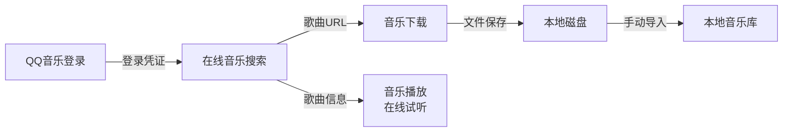
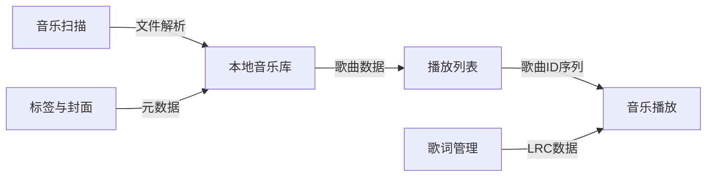
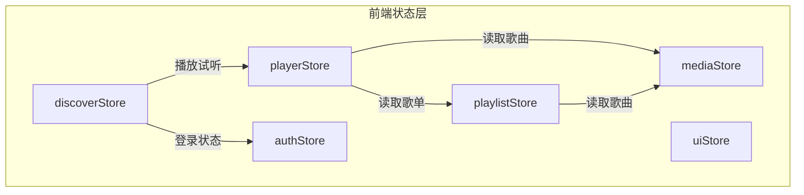
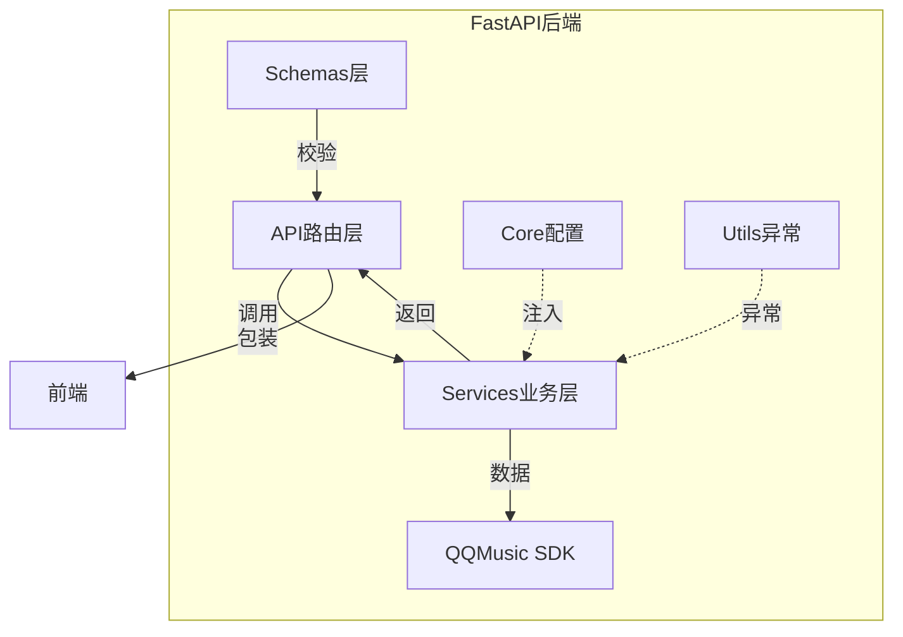

# LLMusic — 模块说明文档

> 本文档从业务功能视角说明系统的模块划分、端侧职责和协作关系。
> `doc/项目结构文档.md` 负责说明代码组织结构，本文档负责说明业务模块如何支撑产品能力。
> 更新日期：2026-07-02
>
> - P0-1（已完成）：玻璃阴影单源化、玻璃变量移出 @theme 到独立 :root
> - P1-1（已完成）：PlayerBar 叠加 SVG RGB 色差玻璃 filter
> - P1-2（已完成）：ContextMenu/CustomModal/DeleteConfirmDialog/TagEditor 出场动画（Vue Transition）
> - P1-3（已完成）：PlayerBar box-shadow 过渡修复
> - P1-4（已完成）：useGlassStyles.ts 重构（删除 elevated/hoverBg/classes）
>
> ~~Electron 主进程代码语言：JavaScript（第二阶段已迁移为 TypeScript）~~

---

## 1. 文档定位

本文档面向参与 LLMusic 开发的开发者，帮助理解系统的业务功能设计、各模块的职责边界以及典型业务流程。阅读建议：先通读第 2-4 节建立整体认知，再按需查阅第 5 节的具体模块说明。

## 2. 系统功能定位

LLMusic 是一个**桌面本地音乐播放器**，同时提供**在线音乐发现与下载**能力。系统围绕以下核心能力方向设计：

| 能力方向 | 业务目标 | 用户价值 |
|---------|---------|---------|
| 本地音乐管理 | 组织、浏览、管理本地音频文件 | 建立个人音乐库 |
| 在线音乐发现 | 搜索 QQ 音乐曲库、获取下载链接 | 扩展音乐收藏 |
| 音乐播放体验 | 高质量音频播放、歌词同步、播放模式控制 | 沉浸式听歌 |
| 歌单与收藏 | 创建和管理播放列表 | 按主题组织音乐 |
| 元数据维护 | 编辑歌曲标签、管理封面 | 保持音乐库整洁 |

## 3. 端侧职责划分

| 端侧 | 职责定位 | 设计关注点 |
|------|---------|-----------|
| Electron 主进程 | 桌面壳层、IPC 桥接、本地数据持久化、音频引擎、文件系统操作 | 窗口生命周期、进程管理、数据一致性 |
| **Vue 渲染进程（TypeScript）** | UI 渲染、用户交互、状态管理、在线 API 调用 | 组件化、类型安全、状态响应式、体验流畅度 |
| FastAPI 后端 | 在线音乐业务逻辑层，代理 qqmusic-api 的 HTTP 封装 | 接口幂等性、错误码统一、凭证管理 |
| 本地数据库 (lowdb) | JSON 文件级持久化，存储歌曲/歌单/音乐库/设置 | 读写性能、数据完整性（无迁移设计） |
| QQ Music SDK | 外部 SDK，提供 QQ 音乐搜索、下载、登录等底层能力 | SDK 版本兼容、异常隔离 |

## 4. 功能模块总览

| 模块 | 定位 | 核心产出 |
|------|------|---------|
| 本地音乐库 | 本地音频文件的组织与检索 | 歌曲列表、音乐库管理、搜索过滤 |
| 在线音乐搜索 | QQ 音乐曲库的发现与获取入口 | 关键词搜索、链接解析、歌曲结果展示 |
| 音乐下载 | 从在线曲库获取音频文件到本地 | 单曲保存、批量下载 |
| QQ 音乐登录 | 在线服务的使用权限管理 | 二维码登录、凭证持久化、登录状态维护 |
| 音乐播放 | 核心听歌体验 | 播放/暂停/seek、播放模式、媒体会话 |
| 歌词管理 | 歌词获取与同步展示 | LRC 解析、时间轴同步、歌词页面 |
| 播放列表 | 歌曲的主题组织 | 歌单 CRUD、歌曲分配 |
| 音乐扫描 | 本地文件的入库 | 目录扫描、文件解析、进度报告 |
| 标签与封面 | 歌曲元数据维护 | 标签编辑、封面提取与替换 |
| 窗口与UI壳 | 应用窗口与界面容器 | 窗口控制、侧边栏、标题栏、PlayerBar、玻璃组件 |
| 系统设置 | 用户偏好持久化 | 关闭行为、展示偏好 |

## 5. 各业务模块说明

### 5.1 本地音乐库

**定位**：系统的数据核心层，管理所有本地歌曲的元数据和音乐库组织结构。

**核心功能**：
- 音乐库的增删改查（每个库对应一个目录）
- 歌曲数据的全量加载与查询
- 按歌手、歌名等维度的搜索过滤
- 歌曲播放次数统计与持久化
- 歌曲的导入（从文件解析后入库）和删除

**设计边界**：
- 不负责音频文件的移动/复制/重命名（仅记录文件路径），但**删除歌曲时同时删除本地文件及侧边 `.lrc`**
- 不直接处理文件扫描逻辑（由音乐扫描模块负责）
- 歌曲数据源全部来自 Electron 主进程的 lowdb 数据库

**关联模块**：音乐扫描（数据来源）、音乐播放（播放计数回写）、播放列表（歌单引用歌曲 ID）

**开发关注点**：
- 歌曲 ID 是跨模块引用的唯一键，变更需要同步所有引用方
- 音乐库切换时需完整替换歌曲列表
- 搜索过滤应在客户端进行，避免全量传输

### 5.2 在线音乐搜索

**定位**：连接 QQ 音乐曲库的发现入口，提供关键词和链接两种搜索方式。

**核心功能**：
- 关键词搜索：输入歌名/歌手名，从 QQ 音乐搜索并返回结果列表
- 链接搜索：解析 QQ 音乐分享链接（单曲/歌单），获取歌曲详情
- 专辑封面获取：根据专辑 MID 拼接封面 URL
- 试听入口：将搜索结果传入播放器进行在线试听

**设计边界**：
- 不负责音频数据的实际下载（由音乐下载模块负责）
- 搜索结果中的下载链接只返回 URL，不触发下载
- 封面 URL 是静态拼接结果，不与 QQ 音乐保持实时同步

**关联模块**：QQ 音乐登录（需要登录凭证获取下载链接）、音乐下载（消费歌曲 URL）、音乐播放（在线试听）

**开发关注点**：
- 搜索结果分三步串行填充：搜索 → 封面 → 下载链接，每步可独立失败
- 链接搜索依赖解析重定向，URL 格式变化可能导致解析失败
- 搜索结果需在内存中完整保留，避免重复请求

### 5.3 音乐下载

**定位**：将从 QQ 音乐获取的音频文件保存到用户本地磁盘，并自动写入元数据。

**核心功能**：
- 单曲下载：弹窗选择保存路径，下载单首歌曲
- 批量下载：选择目录后依次下载多首歌曲
- 下载状态管理：标记每首歌曲的下载进行中状态
- **元数据嵌入**：下载后自动写入歌曲标签（标题、歌手、专辑、曲目号、流派、年份）、封面图片、LRC 歌词

**设计边界**：
- 不参与下载链接的获取逻辑（由在线搜索模块完成）
- **元数据获取通过后端 `/song/download-bundle` 接口一次性聚合**，平台无关，后续多平台可复用
- 不管理已下载文件与本地音乐库的关联（用户手动导入）

**关联模块**：在线音乐搜索（URL 来源）、后端 `/song/download-bundle`（元数据来源）、本地音乐库（手动导入目标）

**元数据写入策略**：
- **MP3**：使用 `node-id3` 库写入标准 ID3v2.4 标签（USLT 歌词帧、APIC 封面帧）
- **FLAC**：使用 `node-id3` 写入 ID3v2 标签（USLT 歌词帧、APIC 封面帧）

**开发关注点**：
- 批量下载需串行执行，避免并发导致资源竞争
- 下载失败不影响队列中其他歌曲的下载
- 文件命名格式为 `{歌名} - {歌手}.{格式}`
- 元数据/封面/歌词任一步获取失败时降级为裸音频下载，不阻塞用户

### 5.4 QQ 音乐登录

**定位**：为在线音乐功能提供身份认证和凭证管理。

**核心功能**：
- 登录状态查询：检测本地凭证文件是否存在
- 二维码生成：创建 QQ/微信扫码登录会话
- 登录状态轮询：前端定时查询二维码扫描结果
- 凭证管理：登录成功后持久化 credential.json，刷新 SDK 客户端
- 退出登录：清除凭证、重置客户端、清理活跃会话

**设计边界**：
- 不处理账号密码登录，仅支持二维码扫码
- 凭证文件由后端管理，前端只读取状态
- 不涉及 OAuth、JWT 等通用认证协议

**关联模块**：在线音乐搜索（需要凭证获取下载链接）

**开发关注点**：
- 二维码会话有过期时间（180秒），前端需及时操作
- 凭证过期后需静默重新登录或提示用户
- 会话管理使用内存字典，重启后需重新登录

### 5.5 音乐播放

**定位**：系统的核心体验模块，提供完整的音频播放控制。

**核心功能**：
- 本地音频播放（通过 Electron 的 Web Audio API）
- 在线音频播放（通过 HTML5 Audio API，`playOnlineSong`/`_playOnlineUrl` 控制 Audio 元素）
- 在线队列管理：支持在线歌单的顺序/随机/单曲循环连续播放（`onlinePlayQueue`）
- 播放控制：播放/暂停/停止/seek
- 播放模式：顺序播放、随机播放、单曲循环
- 播放列表管理：添加/移除歌曲，列表验证
- 播放次数统计（播放时长的 1/5 触发计数）
- 媒体会话集成（Media Session API）
- 播放器状态持久化（localStorage）

**设计边界**：
- 不直接管理音频文件（由 Electron 主进程提供音频数据）
- 不负责歌词的获取和外部存储（仅消费歌词数据）
- 在线与本地使用两套不同的音频 API（隔离设计）

**关联模块**：本地音乐库（歌曲数据来源），歌词管理（消费歌词），播放列表（播放列表操作），在线音乐搜索（在线试听来源）

**开发关注点**：
- 在线/本地音频切换时需要完全停止另一套引擎
- 播放状态持久化需处理歌曲被删除后的恢复逻辑
- 随机播放模式使用 Fisher-Yates 洗牌 + 历史栈实现
- 本地 seek 操作复用已解码的 `AudioBuffer`（`sourceNode.start(0, offset)`）；在线 seek 监听 HTML5 Audio 的 `seeked` 事件确认跳转生效，无需 IPC
- 在线歌曲播放时 `playerStore.currentSong` 为 null，通过 `onlineSongName`/`onlineSinger` 展示曲目信息
- HTML5 Audio 的 `duration`（歌曲时长）在 `loadedmetadata` 事件后才可用，需通过响应式 ref 追踪
- **在线队列统一**：`playNext()`/`playPrevious()` 统一处理本地和在线模式，通过 `isOnlineSong` 分流。在线队列（`onlinePlayQueue`）支持顺序/随机/单曲循环三种模式，与本地行为一致
- **`window._playOnlineUrl` 桥接**：playerStore 通过 `window._playOnlineUrl` 直接控制 HTML5 Audio 的创建/切歌/播放，消除 watcher 异步竞争，确保播放操作同步执行
- **启动时 `currentSong` 空处理**：启动时从 localStorage 恢复的 `currentSong` 若在歌曲库中不存在，PlayerBar 自动隐藏（`hasValidSong` 计算属性）
- **在线歌曲详情入口**：点击搜索或歌单中的在线歌曲行 → 自动播放 → 通过 `getSongDownloadBundle` 加载歌词 → 进入 LyricPage 全屏展示封面和歌词
- **在线音量/静音同步**：音量调节和静音切换同时同步到本地 `gainNode` 和在线 `window._onlineAudio.volume`，修复在线歌曲静音无效果问题
- **在线歌曲不跨会话持久化**：`savePlayerState()` 跳过在线歌曲状态，`loadPlayerState()` 检测到 `isOnlineSong` 时清空所有在线数据，避免重启后显示失效的歌曲信息

### 5.6 歌词管理

**定位**：提供歌词的获取、解析和同步展示能力。

**核心功能**：
- 歌词加载：从本地文件或嵌入标签中读取歌词
- LRC 格式解析：时间戳与文本的映射
- 逐字歌词解析：`<mm:ss.xx>字` 格式提取字级时间轴
- 翻译/音译合并：同时间戳多行自动合并为翻译/音译
- 歌词同步：根据播放进度高亮当前歌词行（支持逐字高亮）
- 歌词跳转：点击歌词行跳转到对应播放位置
- 同步偏移调整：微调歌词时间轴偏差
- 独立歌词状态管理：lyricsStore 管理歌词状态，从 playerStore 剥离

**设计边界**：
- 不参与歌词的编辑和保存（只读消费）
- 支持 LRC 格式标准时间戳、逐字歌词 `<time>字`、JSON 同步歌词三种格式
- 本地歌词数据来自 Electron 主进程；在线歌词通过后端 `/song/download-bundle` 接口获取 LRC 文本，由 `lyricsStore.loadOnlineLyrics()` 前端解析

**关联模块**：音乐播放（提供播放时间线）、Electron 主进程（歌词文件读取）、lyricsStore（歌词状态管理）

**开发关注点**：
- 无效时间戳歌词按播放比例推算当前行
- 歌词高亮索引更新需要与 seek 操作协同
- 歌词同步偏移量以毫秒为单位，支持实时调整
- 逐字歌词 `isWordActive` 在播放循环中高频触发，需注意计算性能
- template 中 `displayLines` 过滤了空行，与 `lyricsStore.lines` 索引不同，点击跳转时需通过 displayLines 查找

### 5.7 播放列表

**定位**：提供歌单的管理能力，让用户按主题组织音乐。系统包含两种歌单类型：**本地播放列表**和 **QQ 音乐歌单**。

#### 5.7.1 本地播放列表（playlistStore）

**核心功能**：
- 歌单的创建、编辑、删除
- 歌单内歌曲的添加和移除
- 歌单列表在侧边栏展示，点击后在右侧显示 PlaylistContent 详情
- 歌单内容的展示与播放

**设计边界**：
- 不参与播放器播放列表的运行时管理（由 playerStore 管理）
- 歌单只存储歌曲 ID 列表，不复制歌曲数据
- 删除歌单不影响其中歌曲在音乐库中的存在

**关联模块**：本地音乐库（歌曲数据来源）、音乐播放（消费歌单播放）

**开发关注点**：
- 歌单删除后需导航回到主界面
- 歌单中的歌曲可能被删除，需处理引用失效
- 播放列表操作与 playerStore 需保持同步

#### 5.7.2 QQ 音乐歌单（qqmusicStore）

**核心功能**：
- 从 QQ 音乐 API 获取用户创建的歌单列表（含"我喜欢的音乐"）
- 歌单列表直接在侧边栏渲染，点击后右侧显示 QQMusicPlaylistDetail 详情
- 歌单歌曲支持搜索过滤（本地实时筛选，匹配歌名/歌手）
- 歌单歌曲支持"播放全部"（构建在线队列 `onlinePlayQueue` 连续播放）
- 歌单歌曲支持试听（HTML5 Audio）和下载
- 点击歌名进入 LyricPage 全屏详情页，展示大封面和歌词
- 自动识别"我喜欢的音乐"歌单，其歌曲走 `/user/liked` 接口，其他歌单走 `/playlist/{id}/songs` 接口

**设计边界**：
- 歌单数据来自 QQ 音乐后端 API，不存储在本地
- 歌单歌曲的播放 URL 需二次请求 `/song/song-url` 接口获取
- 需要 QQ 音乐登录凭证才能获取完整数据

**关联模块**：QQ 音乐登录（访问凭证）、音乐播放（在线试听）、音乐下载（保存歌曲）

**开发关注点**：
- 歌单歌曲由后端自动翻页一次性加载，播放 URL 在后端批量获取后回填
- 侧边栏渲染时根据 `likedPlaylistId` 区分"我喜欢的音乐"（heart 图标）和普通歌单（list 图标）
- URL 获取失败不应阻塞歌曲列表的展示

### 5.8 音乐扫描

**定位**：将本地磁盘上的音频文件解析入库。

**核心功能**：
- 目录递归扫描
- 音频文件格式过滤（mp3/flac/wav/m4a/ogg/aac 等十余种常见格式）
- 元数据解析（通过 music-metadata 库）
- 扫描进度实时报告（通过 `onScanProgress` IPC 事件推送到前端 `mediaStore.scanProgress`，`GlobalScanProgress` 组件实时显示）
- 扫描取消

**设计边界**：
- 不处理非音频文件
- 不移动或复制文件
- 不检测重复文件

**关联模块**：本地音乐库（数据入库目标）

**开发关注点**：
- 大目录扫描需使用 Worker 进程避免阻塞主线程
- 进度报告需高频更新但不影响扫描性能
- 文件缺失或格式异常应跳过而非中断扫描

### 5.9 标签与封面

**定位**：提供歌曲元数据的查看和编辑功能。

**核心功能**：
- 读取音频文件内嵌标签（歌手、专辑、曲目号等）
- 修改并写回音频文件标签
- 封面提取（通过 music-metadata 解析内嵌封面，或搜索目录封面文件）
- 在线元数据搜索匹配（通过 Electron IPC 代理到 FastAPI 后端调用 QQ 音乐搜索）

**设计边界**：
- 不维护标签历史版本
- 不校验修改后标签的合法性（格式兼容由库处理）

**关联模块**：本地音乐库（歌曲对象关联）

**开发关注点**：
- 标签写回是直接修改原始音频文件，需确认用户意图
- 不同音频格式的标签标准不同（ID3v2/FLAC/Vorbis）
- 写回操作前应进行变更校验

### 5.10 窗口与UI壳

**定位**：提供应用窗口容器和基础 UI 框架。

**核心功能**：
- 窗口最小化/最大化/关闭/显示控制
- 自定义标题栏
- 侧边栏导航（可收缩/拖拽调整宽度）
- 视图切换（主界面/发现音乐/设置等）
- 系统托盘图标
- 后端子进程生命周期管理

**设计边界**：
- 不包含任何业务逻辑
- 不直接处理音乐数据

**关联模块**：所有业务模块（都依赖壳层提供的窗口和 IPC 能力）

**开发关注点**：
- 窗口关闭行为（退出/最小化到托盘）由用户设置决定
- 侧边栏宽度和可见状态需持久化
- 后端进程异常退出需优雅处理
- **侧边栏底部导航重构**："元数据管理"和"设置"已从侧边栏底部移除，"设置"入口移至 TitleBar 左侧齿轮按钮，"元数据管理"作为设置页内的一个板块，消除与浮动 PlayerBar 的遮挡冲突

### 5.11 PlayerBar 播放控制栏

**定位**：底部悬浮的音频播放控制中心，提供播放控制、进度管理、音量调节和视图切换。

**核心功能**：
- 播放控制：上一首/播放暂停/下一首
- 进度控制：进度条点击跳转，实时时间显示
- 音量控制：拖动调节音量，一键静音
- 播放模式切换：顺序/随机/单曲循环
- 辅助功能：收藏、歌词、播放列表、收缩展开
- **折叠/自动隐藏**：点击 [▼] 按钮或 5s 无操作收缩为 B2 胶囊浮标，鼠标移入或点击 [▲] 恢复完整条，支持自动隐藏模式
- **玻璃质感**：胶囊使用 `backdrop-filter: saturate+brightness+blur` 配合多层 `inset/outer box-shadow` 模拟光学玻璃效果

**展开/收缩动画**（共享 DOM + 压缩过渡）：
- 展开态和收缩态**共用同一组 DOM 元素**，不进行 DOM 替换
- 封面元素平滑过渡：44×44 方形（`border-radius: 12px`）↔ 36×36 圆形（`border-radius: 50%`），通过 CSS `transition` 驱动
- 辅助控制区（badge/按钮/进度条/音量）在收缩时通过 `max-width:0` + `opacity:0` 压缩消失，视觉上如同手风琴收拢
- 容器高度 `64px ↔ 52px` 同步过渡，所有过渡属性统一 `0.35s cubic-bezier(.16,1,.3,1)`（Mineradio 缓出曲线）

**B2 胶囊浮标（收缩态）**：
- 36×36 圆形封面（`border-radius: 50%`），两行歌名截断
- 仅保留播放/暂停按钮和 [▲] 展开按钮
- 高度 52px（完整态 64px），`width: fit-content` 自适应
- **conic-gradient 边框进度环**：使用 `::after` 伪元素 + `mask-composite: exclude`，2px 绿色边框沿胶囊轮廓走一圈，`--progress-deg` CSS 变量驱动进度角度
- 响应式适配：`max-width` 随视口缩小

**音量实现**：
- 本地播放：通过 `window.gainNode.gain.value` (Web Audio API)
- 在线播放：通过 `window._onlineAudio.volume` (HTML5 Audio) — 原缺失，已修复
- 静音切换同步更新两套引擎

**关联模块**：音乐播放（消费播放状态）、歌词管理（歌词入口）、播放列表（列表入口）

### 5.12 玻璃质感组件体系

**定位**：为应用提供可复用的玻璃质感 UI 基元，增强视觉层次感。

**架构**：采用 **单源 CSS 变量** 体系，所有玻璃值在 `sys_vue/src/styles/tailwind-entry.css` 的 `:root` 中统一定义，组件通过 `var(--glass-*)` 引用（已完成 P0-1 重构，详见 [`doc/样式与动画优化方案.md`](./样式与动画优化方案.md)）。

**变量分层**：
- **原子层**（8 个）：`--glass-highlight`、`--glass-glow`、`--glass-outer-sm/md/lg`、`--glass-inset-sm/md/lg`
- **组合层**（引用原子变量构建）：`--glass-panel-shadow`、`--glass-panel-hover-shadow`、`--glass-btn-shadow`、`--glass-btn-hover-shadow`
- **背景隔离**：`--glass-bg`（统一 .10）、`--glass-playerbar-bg`（保留 .12）

**核心组件**：
- `GlassPanel.vue` — 通用玻璃容器，`variant: panel/button`，50px 胶囊圆角、`backdrop-filter` 模糊，阴影引用 `var(--glass-panel-shadow)`/`var(--glass-btn-shadow)`
- `GlassButton.vue` — 玻璃按钮，`variant: default/accent`，hover 时高光增强 + 外发光，所有玻璃值引用 `var(--glass-*)`
- `useGlassStyles.ts` — 玻璃样式计算 composable，供额外组件（GlassModal/GlassInput 等）复用，已删除 `shadowLayers`/`elevated`/`hoverBg`/`classes` 虚代码

**SVG 色差玻璃**：
- 在 `index.html` 中全局定义 `mr-glass` SVG filter（RGB 三通道色差位移）
- PlayerBar 内部通过独立 `.ribbon-glass-overlay` 覆盖层叠加 SVG filter，不替换原有 `backdrop-filter`
- SVG filter 参数已适配 PlayerBar 64px 高度：`scale=5/4/3`，`dx=0`
- 相关 CSS 变量 `--glass-svg-filter: url(#mr-glass)` 定义在 `tailwind-entry.css` 的 `:root` 中

**设计 token**（`tailwind-entry.css` 的 `:root` 块）：
- 原子值：`--glass-bg`、`--glass-playerbar-bg`、`--glass-radius`、`--glass-blur`、`--glass-saturate`、`--glass-brightness`
- 阴影原子：`--glass-highlight`、`--glass-glow`、`--glass-outer-sm/md/lg`、`--glass-inset-sm/md/lg`
- 组合阴影：`--glass-panel-shadow`、`--glass-panel-hover-shadow`、`--glass-btn-shadow`、`--glass-btn-hover-shadow`
- SVG 滤镜：`--glass-svg-filter: url(#mr-glass)`
- 浅色主题占位 token 已预留

**使用场景**：PlayerBar 全态玻璃胶囊、搜索栏、模态框背景、功能按钮

**开发原则**：
- 修改玻璃视觉效果只需编辑 `tailwind-entry.css` 中的 `:root` 变量，所有组件同步更新
- 禁止在组件中硬编码玻璃阴影/背景/模糊值

### 5.13 系统设置

**定位**：管理用户的偏好配置。

**核心功能**：
- 窗口关闭行为配置（退出应用/最小化到托盘）
- 歌词页面动画效果设置（淡入/滑动）
- 偏好数据的读写持久化

**设计边界**：
- 不做深度配置（如音质选择、主题色等）
- 配置项通过 Electron IPC 在主进程和渲染进程间同步

**关联模块**：窗口与UI壳

**开发关注点**：
- 设置变更需同步更新到 localStorage 和主进程
- 配置项从主进程初始化时需与本地存储保持一致

## 6. 通用支撑能力

### 6.1 统一响应与异常处理（后端）

后端的 API 层统一使用 `success()` / `error()` 构造响应，通过 `ServiceException` 传递业务异常。API 层只捕获 `ServiceException`，未预期异常由全局异常处理器兜底。

**开发时应避免**：
- 在 API 层直接拼接 `{"code": ..., "message": ...}` 响应
- 在 Service 层返回 `ApiResponse` 或 `success()` 结果
- 在 Schema 中编写业务判断逻辑

### 6.2 IPC 通信桥梁（Electron <-> Vue）

Electron 主进程通过 `ipcMain.handle` 注册通道，Vue 渲染进程通过 `contextBridge` 暴露的 `window.electronAPI` 调用。通道名统一在 `ipcChannels.js` 中管理。

**开发时应避免**：
- 在渲染进程中直接使用 `ipcRenderer`（必须通过 preload 桥接）
- 在多个地方硬编码 IPC 通道名

### 6.3 状态管理（Vue + TypeScript）

前端使用 Pinia 管理全局状态，每个业务模块对应一个 Store（media/player/playlist/discover/auth/ui/lyrics/qqmusic）。Store 间通过 `useXxxStore()` 相互调用。

**TypeScript 相关规范**：
- Store 使用 `defineStore` 泛型定义，`state()` 返回类型化初始值
- `ref(null)` 和 `ref([])` 必须指定泛型参数（如 `ref<Song | null>(null)`）
- Store action 函数参数显式标注类型
- 组件中通过 Store 访问的状态自动推断类型

**开发时应避免**：
- 组件内直接修改跨组件共享的状态（应通过 Store action）
- Store 间循环依赖（使用动态 import 解决）

### 6.4 自定义组件库

前端模板层已从 Element Plus 完全迁移到自定义组件体系，现有 `CustomButton`、`CustomInput`、`CustomSelect`、`CustomCheckbox`、`CustomModal`、`ProgressBar`、`LoadingSpinner`、`FAIcon`、`GlassPanel`、`GlassButton` 等组件。Element Plus 已被完全移除，组件模板中已无使用。

**玻璃质感组件**：
- `GlassPanel.vue` — 通用玻璃容器，适用于底部栏、搜索栏、模态框
- `GlassButton.vue` — 玻璃按钮，适用于沉浸模式下的辅助操作
- `useGlassStyles.ts` — 样式计算 composable，供自定义玻璃组件复用
- 设计 token 统一在 `tailwind-entry.css` 的 `:root` 中定义（玻璃变量），`@theme` 仅保留 Tailwind 工具类变量

**TypeScript 相关规范**：
- Props 使用泛型语法 `defineProps<Props>()` + `withDefaults()`，禁止运行时声明
- Emits 使用泛型语法 `defineEmits<{...}>()`，禁止数组语法
- 所有 `.vue` 文件必须使用 `<script setup lang="ts">`

**开发时应避免**：
- 引入新的 Element Plus 组件
- 为单一使用场景创建新的自定义组件

### 6.5 QQ Music API 客户端管理（后端）

`app/qqmusic/client.py` 管理全局的 `qqmusic_api.Client` 单例，登录/退出时刷新客户端。后端代码统一通过 `get_client()` 获取实例。

**开发时应避免**：
- 在多个地方直接创建 `Client()` 实例
- 在 service 中直接管理凭证文件路径

## 7. 模块间关键关系

### 7.1 在线音乐获取链路

核心语义：用户在 QQ 音乐登录后，可以通过搜索发现歌曲，获取下载链接后保存到本地，再通过导入进入本地音乐库管理。

### 7.2 本地音频播放链路

核心语义：歌曲从文件扫描入库开始，经过音乐库组织和播放列表编排，最终由播放器消费，歌词和封面作为辅助信息同步展示。

### 7.3 数据依赖关系

核心语义：mediaStore 是前端数据的基石；playerStore 和 playlistStore 依赖 mediaStore 的歌曲数据；discoverStore 依赖 authStore 的登录状态并通过 playerStore 提供试听能力。

### 7.4 后端分层依赖

核心语义：后端的四层架构中，API 层只调用 Service 层，Service 层调用 QQMusic SDK，所有响应通过统一格式返回给前端。

## 8. 典型业务闭环

### 8.1 发现并下载一首新歌

1. 用户在侧边栏点击"发现音乐"切换到 discover 视图
2. 选择搜索模式（关键词搜索或链接搜索），输入内容
3. 前端调用后端搜索接口，获取歌曲列表（含封面和下载链接）
4. 用户点击歌曲的"试听"按钮，播放器创建 HTML5 Audio 播放在线试听
5. 用户确认歌曲后点击"下载"，Electron 弹出保存对话框
6. 文件通过 `net.fetch` 下载到用户选择的路径

### 8.2 将本地音乐导入并播放

1. 用户在设置中添加音乐库目录
2. Electron 主进程启动扫描，遍历目录中的音频文件
3. 通过 `music-metadata` 解析每首歌的元数据，入库到 lowdb
4. 前端 musicStore 加载更新后的歌曲列表
5. 用户在 MusicLibrary 页面浏览歌曲
6. 点击某首歌触发 playerStore.playSong，播放器通过 Web Audio API 开始播放

### 8.3 QQ 音乐登录后搜索

1. 用户在发现音乐页面点击"扫码登录"
2. 前端调用后端创建二维码会话，获取 base64 编码的二维码图片
3. 用户用 QQ/微信扫码，前端每 1.5 秒轮询登录状态
4. 登录成功后，后端持久化 credential.json，前端 authStore 更新登录状态
5. 用户输入关键词搜索，后端使用已登录的 Client 实例调用 QQ Music SDK
6. 搜索结果附带下载链接（需要登录凭证才能获取）

### 8.4 创建并播放一个歌单

1. 用户在侧边栏点击"新建歌单"，填写名称和描述
2. Electron 主进程在数据库中创建播放列表记录
3. 用户在 MusicLibrary 页面勾选多首歌曲，选择"添加到歌单"
4. 前端调用 playlistStore.addSongsToPlaylist，通过 IPC 更新数据库
5. 用户在侧边栏点击歌单进入 PlaylistContent 页面
6. 点击"播放全部"，前端将歌单中的歌曲 ID 列表传入 playerStore
7. 播放器开始顺序播放歌单中的所有歌曲

### 8.6 浏览 QQ 音乐歌单并试听

1. 用户登录 QQ 音乐后，侧边栏自动加载所有歌单（含"我喜欢的音乐"）
2. "我喜欢的音乐"显示 heart 图标，普通歌单显示 list 图标
3. 点击歌单项，右侧主内容区直接显示 QQMusicPlaylistDetail 页面
4. 页面调用 `/playlist/{id}/songs/all` 一次性获取全部歌曲及播放 URL
5. 用户可在搜索框筛选当前歌单歌曲（实时匹配歌名/歌手）
6. 用户点击"播放全部"按钮，`playerStore.playOnlineSong` 构建 `onlinePlayQueue` 队列并开始连续播放（支持顺序/随机/单曲循环）
7. 用户点击"试听"按钮，`playerStore.playOnlineSong` 以当前筛选列表为队列上下文播放
8. 用户点击"下载"按钮，通过 `window.electronAPI.downloadFile` 保存到本地
9. **用户点击歌名/歌手文字** → 自动播放该歌曲（以当前筛选列表为队列）→ 通过 `/song/download-bundle` 加载歌词 → 进入 LyricPage 全屏详情页面，展示大尺寸封面和动态歌词

### 8.7 编辑歌曲标签并更新封面

1. 用户在 MusicLibrary 右键歌曲选择"编辑标签"
2. TagEditor 组件从音频文件读取当前标签（歌手/专辑/曲目号）
3. 用户修改标签字段，前端通过 IPC 调用 Electron 的标签写回功能
4. 用户点击"提取封面"，Electron 使用 music-metadata 库从文件解析内嵌封面图片
5. 封面图片通过 IPC 传递到前端展示
6. 修改后的元数据同步更新到音乐库数据库

## 9. 后续开发参考原则

1. **新增 IPC 通道必须在 `ipcChannels.js` 声明常量**，禁止在 handler 和 preload 中硬编码通道名字符串
2. **后端新增接口必须走四层架构**：API → Service → Schema → 外部 SDK，不允许 API 层直接调用 SDK
3. **Service 失败只通过 `raise ServiceException`，不返回 None 或错误对象**，API 层统一捕获包装
4. **不要在前端 Store 中直接调用 `ipcRenderer`**，所有 electronAPI 调用通过 preload 桥接
5. **不要在组件内直接修改跨组件 Store 的状态**，必须使用 Store 的 action
6. **搜索结果的三步填充（搜索→封面→链接）允许单步失败**，不应因封面获取失败阻塞搜索结果展示
7. **不同音频环境（在线/本地）使用独立的播放引擎**，切换时需完全停止另一套
8. **新增自定义 UI 组件前先确认是否可以使用现有自定义组件组合实现**，避免组件泛化
9. **后端错误码使用 `ErrorCode` 枚举**，不允许硬编码数字错误码
10. **歌曲 ID 是跨模块引用的唯一键**，删除歌曲需要同步清理播放列表中的引用
11. **前端新文件默认 TypeScript**：`*.ts` 替代 `*.js`，`.vue` 文件使用 `<script setup lang="ts">`
12. **Props/Emits 使用泛型语法**：`defineProps<Props>()` + `withDefaults()`，`defineEmits<{...}>()`，禁止运行时声明
13. **按需导入类型**：仅引入类型时使用 `import type { ... }`，禁止用 `import { ... }` 导入类型
14. **`ref()` 泛型规则**：`ref(null)` 必须加泛型参数，`ref([])` 必须加泛型参数
15. **构建前执行类型检查**：`npm run build` 包含 `vue-tsc --noEmit`，类型检查失败不构建
