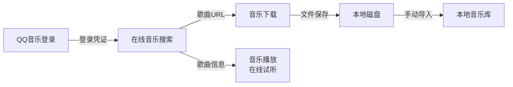
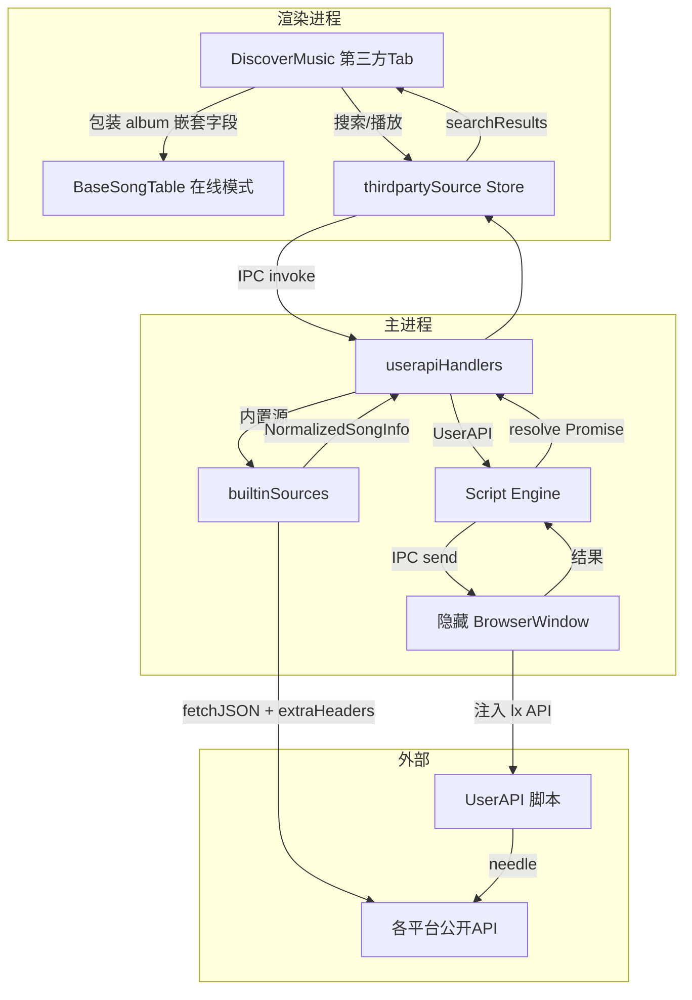

# LLMusic — 模块说明文档

> 本文档从业务功能视角说明系统的模块划分、端侧职责和协作关系。
> `doc/项目结构文档.md` 负责说明代码组织结构，本文档负责说明业务模块如何支撑产品能力。
> 更新日期：2026-07-04

---

## 1. 文档定位

本文档面向参与 LLMusic 开发的开发者，帮助理解系统的业务功能设计、各模块的职责边界以及典型业务流程。阅读建议：先通读第 2-4 节建立整体认知，再按需查阅第 5 节的具体模块说明。

## 2. 系统功能定位

LLMusic 是一个**桌面本地音乐播放器**，同时提供**在线音乐发现与下载**能力。系统围绕以下核心能力方向设计：

| 能力方向 | 业务目标 | 用户价值 |
|---------|---------|---------|
| 本地音乐管理 | 组织、浏览、管理本地音频文件 | 建立个人音乐库 |
| 在线音乐发现 | 搜索 QQ 音乐曲库、获取下载链接 | 扩展音乐收藏 |
| 音乐播放体验 | 高质量音频播放、歌词同步、播放模式控制 | 沉浸式听歌 |
| 歌单与收藏 | 创建和管理播放列表 | 按主题组织音乐 |
| 元数据维护 | 编辑歌曲标签、管理封面 | 保持音乐库整洁 |

## 3. 端侧职责划分

| 端侧 | 职责定位 | 设计关注点 |
|------|---------|-----------|
| Electron 主进程 | 桌面壳层、IPC 桥接、本地数据持久化、音频引擎、文件系统操作、**第三方源插件引擎** | 窗口生命周期、进程管理、数据一致性、脚本沙箱 |
| **Vue 渲染进程（TypeScript）** | UI 渲染、用户交互、状态管理、在线 API 调用 | 组件化、类型安全、状态响应式、体验流畅度 |
| FastAPI 后端 | 在线音乐业务逻辑层，代理 qqmusic-api 的 HTTP 封装（**仅官方模块使用**） | 接口幂等性、错误码统一、凭证管理 |
| 本地数据库 (lowdb) | JSON 文件级持久化，存储歌曲/歌单/音乐库/设置 | 读写性能、数据完整性（无迁移设计） |
| QQ Music SDK | 外部 SDK，提供 QQ 音乐搜索、下载、登录等底层能力 | SDK 版本兼容、异常隔离 |

## 4. 功能模块总览

| 模块 | 定位 | 核心产出 |
|------|------|---------|
| 本地音乐库 | 本地音频文件的组织与检索 | 歌曲列表、音乐库管理、搜索过滤 |
| 在线音乐搜索 | QQ 音乐曲库的发现与获取入口 | 关键词搜索、链接解析、歌曲结果展示 |
| 音乐下载 | 从在线曲库获取音频文件到本地 | 单曲保存、批量下载 |
| 第三方源插件系统 | 独立于官方登录态的插件化音乐发现与下载 | 多源管理、脚本引擎、lx-music 兼容 |
| QQ 音乐登录 | 在线服务的使用权限管理 | 二维码登录、凭证持久化、登录状态维护 |
| 音乐播放 | 核心听歌体验 | 播放/暂停/seek、播放模式、媒体会话 |
| 歌词管理 | 歌词获取与同步展示 | LRC 解析、时间轴同步、歌词页面 |
| 播放列表 | 歌曲的主题组织 | 歌单 CRUD、歌曲分配 |
| 音乐扫描 | 本地文件的入库 | 目录扫描、文件解析、进度报告 |
| 标签与封面 | 歌曲元数据维护 | 标签编辑、封面提取与替换 |
| 窗口与UI壳 | 应用窗口与界面容器 | 窗口控制、侧边栏、标题栏、PlayerBar、玻璃组件 |
| 系统设置 | 用户偏好持久化 | 关闭行为、展示偏好、第三方源管理 |

## 5. 各业务模块说明

### 5.1 本地音乐库（不变）

**定位**：系统的数据核心层，管理所有本地歌曲的元数据和音乐库组织结构。

**核心功能**：音乐库 CRUD、歌曲数据加载、搜索过滤、播放计数、导入/删除。

### 5.2 在线音乐搜索（官方模块）

**定位**：连接 QQ 音乐曲库的发现入口，提供关键词和链接两种搜索方式。

**核心功能**：关键词搜索、链接搜索、专辑封面获取、试听入口。

**设计边界**：
- 搜索结果统一展示在 [官方] Tab
- 搜索结果中的下载链接只返回 URL，不触发下载
- 封面 URL 是静态拼接结果

### 5.3 音乐下载（官方模块）

**定位**：将从 QQ 音乐获取的音频文件保存到用户本地磁盘，并自动写入元数据。

**核心功能**：单曲下载、批量下载、下载状态管理、元数据嵌入（ID3v2.4 标签/APIC 封面/USLT 歌词）。

**设计边界**：
- 不参与下载链接的获取逻辑（由在线搜索模块完成）
- 元数据获取通过后端 `/song/download-bundle` 接口一次性聚合

### 5.3b 第三方源插件系统（2026-07-04 重构）

**定位**：独立于官方 QQ 音乐登录的插件化音乐搜索与下载系统，完全兼容 lx-music UserAPI 协议。

#### 核心架构

第三方源系统采用与官方模块**完全平行独立**的设计：

```
应用搜索
├── [官方] Tab → FastAPI 后端 → QQ SDK（不变）
│   搜索/下载/歌词/封面全部由后端提供
│
└── [第三方] Tab → 主进程插件系统
    ├── 内置源（tx/kw/kg/wy/mg）: 主进程直接搜索公开 API
    │   ├── 搜索 → 各平台公开 API → NormalizedSongInfo（含封面/专辑/时长）
    │   │   ├── TX：`c.y.qq.com/soso/fcgi-bin/search_for_qq_cp` + Referer（原 client_search_cp 已废弃）
    │   │   ├── KW：`search.kuwo.cn/r.s`（HTTP，encoding=utf8 而非 utf-8）+ 非标准 JSON 需修复
    │   │   ├── KG：`songsearch.kugou.com/song_search_v2`，封面用 Image 字段模板
    │   │   ├── WY：`music.163.com/api/search/get` + 额外 song/detail 请求获取封面
    │   │   └── MG：`app.c.nf.migu.cn/MIGUM2.0/v1.0/content/search_all.do` + searchSwitch 参数（原 scr_search_tag 已废弃）
    │   ├── getMusicUrl → TODO (stub)
    │   └── getLyric/getPic → TODO (stub)
    └── UserAPI 脚本 → 隐藏 BrowserWindow 执行
        ├── 导入 .js 文件
        ├── 脚本通过 globalThis.lx 注册能力
        ├── 支持 musicUrl/lyric/pic action
        └── 完全兼容 lx-music 社区脚本
```

#### 系统分层

```
表现层（前端 UI）
├── DiscoverMusic.vue → [官方] [第三方] Tab
├── Settings.vue → 脚本管理面板
└── BaseSongTable.vue → 统一操作列表

调度层（前端 Store → IPC）
├── thirdpartySource.ts → 源管理/搜索/播放
└── 通过 preload.ts 桥接 → IPC invoke

执行层（Electron 主进程）
├── userapiHandlers.ts → IPC 处理器
├── builtinSources.ts → 5 平台内置源
├── engine.ts → 脚本生命周期管理
├── requestQueue.ts → 请求队列 + 超时
├── hiddenWindow.ts → 隐藏 BrowserWindow + SSRF
├── scriptUtils.ts → 脚本解析/压缩/存储
└── renderer/preload.js → globalThis.lx 注入

插件脚本（用户安装）
├── 存放在 userData/userApiScripts.json
├── 社区 lx-music 脚本直接可用
└── 通过 /* @name … @version … */ 注释头解析元信息
```

#### lx-music 兼容性

preload.js 完全复刻了 lx-music 的 `globalThis.lx` API：

| API | 说明 |
|-----|------|
| `lx.request(url, opts, cb)` | HTTP 请求桥（needle 实现），返回 abort 函数 |
| `lx.send('inited', data)` | 脚本注册，声明支持的平台/能力/音质 |
| `lx.on('request', handler)` | 处理 musicUrl/lyric/pic 请求 |
| `lx.utils.crypto` | AES/RSA/MD5 加解密 |
| `lx.utils.buffer` | Buffer 工具 |
| `lx.utils.zlib` | inflate/deflate 压缩 |
| `lx.currentScriptInfo` | 脚本元信息 |
| `lx.version` / `lx.env` | 版本和环境标识 |

**内部安全机制**：
- 隐藏窗口禁用 nodeIntegration、webgl、images
- CSP 严格限制（`default-src 'self'; connect-src *`）
- SSRF 防护（阻止私有 IP 出站连接）
- 请求超时（musicUrl 10s / lyric 8s / pic 8s）
- 请求队列上限 100

#### 关联模块

- DiscoverMusic.vue（第三方 Tab 搜索入口）
- Settings.vue（脚本管理 UI）
- playerStore（复用 HTML5 Audio 播放引擎）

#### 开发关注点

- 内置源的搜索功能已实现并经过修复，各平台 API：
  - **TX**：使用 `search_for_qq_cp` 接口（原 `client_search_cp` 已废弃返回 500），需 `Referer: https://y.qq.com`
  - **KW**：HTTP 协议调用 `search.kuwo.cn/r.s`，**必需 `encoding=utf8`（无连字符）**；返回非标准 JSON（单引号 key），需 `fetchText()` + `fixKuwoJSON()` 修复后解析；封面用 `web_artistpic_short` + `image.kuwo.cn` CDN
  - **KG**：使用 `songsearch.kugou.com/song_search_v2`，封面优先用 `Image` 字段模板（`imge.kugou.com/stdmusic/{size}/...`）
  - **WY**：使用 `music.163.com/api/search/get`，搜索 API 不再返回 `picUrl`，需额外批量调用 `song/detail` 获取封面
  - **MG**：使用 `app.c.nf.migu.cn/MIGUM2.0/v1.0/content/search_all.do`（原 `scr_search_tag` 已废弃返回 301），需 `searchSwitch` 参数 + `Referer`
  - `fetchJSON()` 支持通过 `extraHeaders` 参数传递自定义请求头
  - 搜索结果已包含 `albumName`、`albumCoverUrl`、`duration` 等字段
- discovery 层：搜索结果通过 `DiscoverMusic.vue` 包装 `album:{albumName,albumCoverUrl}` 适配 `BaseSongTable` 在线模式渲染
- 封面加载失败时，`BaseSongTable` 自动回退到占位图标，不会残留空白
- musicUrl/lyric/pic 仍为 stub，实际使用时需搭配 UserAPI 脚本
- 脚本通过 zlib deflate + base64 压缩存储，切换时才解压
- IPC 返回值被 `ipcWrapper.ts` 包装为 `{ success, data }` 格式，preload 中通过 `invokeIPC()` 自动解包

### 5.4 QQ 音乐登录（不变）

### 5.5 音乐播放（不变）

### 5.6 歌词管理（不变）

### 5.7 播放列表（不变）

### 5.8 音乐扫描（不变）

### 5.9 标签与封面（不变）

### 5.10 窗口与UI壳（不变）

### 5.11 PlayerBar 播放控制栏（不变）

### 5.12 玻璃质感组件体系（不变）

### 5.13 系统设置

**定位**：管理用户的偏好配置。

**核心功能**：
- 窗口关闭行为配置（退出应用/最小化到托盘）
- 歌词页面动画效果设置（淡入/滑动）
- 偏好数据的读写持久化
- **第三方源管理**：内置源列表展示、UserAPI 脚本导入/删除/启用禁用、脚本调试工具

## 6. 通用支撑能力（不变）

### 6.1 统一响应与异常处理（后端）
### 6.2 IPC 通信桥梁（Electron <-> Vue）
### 6.3 状态管理（Vue + TypeScript）
### 6.4 自定义组件库
### 6.5 QQ Music API 客户端管理（后端）

## 7. 模块间关键关系

### 7.1 在线音乐获取链路（官方模块）


```mermaid
flowchart LR
    A[QQ音乐登录] -->|登录凭证| B[在线音乐搜索]
    B -->|歌曲URL| C[音乐下载]
    B -->|歌曲信息| D[音乐播放<br>在线试听]
    C -->|文件保存| E[本地磁盘]
    E -->|手动导入| F[本地音乐库]
```

### 7.2 本地音频播放链路（不变）

### 7.3 数据依赖关系（不变）

### 7.4 后端分层依赖（不变）

### 7.5 第三方源数据流


```mermaid
flowchart TD
    subgraph 渲染进程
        A[DiscoverMusic 第三方Tab]
        A2[BaseSongTable 在线模式]
        B[thirdpartySource Store]
    end
    subgraph 主进程
        D[userapiHandlers]
        E[builtinSources]
        F[Script Engine]
        G[隐藏 BrowserWindow]
    end
    subgraph 外部
        H[各平台公开API]
        I[UserAPI 脚本]
    end

    A -->|搜索/播放| B
    B -->|IPC invoke| D
    D -->|内置源| E -->|fetchJSON + extraHeaders| H
    E -->|NormalizedSongInfo| D
    D -->|UserAPI| F -->|IPC send| G
    G -->|注入 lx API| I -->|needle| H
    G -->|结果| F -->|resolve Promise| D
    D --> B
    B -->|searchResults| A
    A -->|包装 album 嵌套字段| A2
```

## 8. 典型业务闭环

### 8.1 发现并下载一首新歌（官方模块，不变）

### 8.2 使用第三方插件搜索并播放

1. 用户在搜索页切换到 [第三方] Tab
2. 源选择器选择目标平台（如 QQ音乐 / 酷我 / 酷狗 / 网易 / 咪咕）
3. 输入关键词进行搜索
4. 主进程内置源向该平台的公开 API 发起搜索请求（各 API 需特定请求头/参数）
5. 返回标准化搜索结果（NormalizedSongInfo，含 albumName / albumCoverUrl / duration）
6. 前端 `DiscoverMusic.vue` 将扁平字段包装为 `album` 嵌套结构适配 `BaseSongTable` 在线模式渲染
7. 用户点击歌曲行的播放按钮
7. 浏览器通过内置源或 UserAPI 获取真实音频 URL
8. HTML5 Audio 开始播放

### 8.3 导入并使用 UserAPI 脚本

1. 用户进入设置页 → 「第三方源管理」
2. 点击「导入」按钮，选择 lx-music 兼容的 .js 脚本文件
3. 主进程解析脚本注释头（name/version/author）
4. 脚本内容经 zlib 压缩后存储到 userApiScripts.json
5. 脚本出现在源列表中，用户可启用/禁用
6. 启用后可在搜索页选择该脚本作为当前源
7. 脚本通过隐藏 BrowserWindow 加载，inited 后即可响应 request

### 8.4 导入社区 lx-music 脚本

1. 从 GitHub（如 lx-music-source 仓库）下载 .js 脚本文件
2. 在设置页导入该脚本
3. 脚本自动注册其支持的平台和音质
4. 切换到该脚本后，搜索仍用内置源，播放/下载走脚本的 musicUrl

## 9. 后续开发参考原则（新增条款）

1. **IPC 通道必须在 `ipcChannels.ts` 声明常量**，禁止硬编码
2. **新增第三方源相关代码放在 `handlers/thirdparty/` 下**，保持模块化
3. **preload.js 不得修改 lx-music 协议**，确保社区脚本兼容性
4. **隐藏窗口安全策略不得削弱**（SSRF 防护、contextIsolation、CSP）
5. **所有 UserAPI IPC 请求必须经过 requestQueue**，确保超时和错误处理统一
6. **内置源搜索结果必须标准化为 NormalizedSongInfo**，确保前端统一展示
