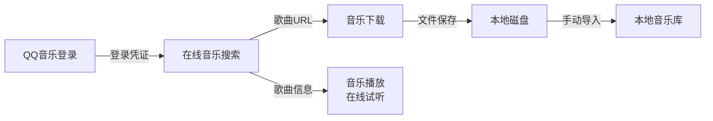

# LLMusic — 模块说明文档

> 本文档从业务功能视角说明系统的模块划分、端侧职责和协作关系。
> `doc/项目结构文档.md` 负责说明代码组织结构，本文档负责说明业务模块如何支撑产品能力。
> 更新日期：2026-07-05（§5.6a 新增 LyricPage 封面区域动画增强 / §5.10b 新增 BaseSongTable / 性能优化补充）

---

## 1. 文档定位

本文档面向参与 LLMusic 开发的开发者，帮助理解系统的业务功能设计、各模块的职责边界以及典型业务流程。阅读建议：先通读第 2-4 节建立整体认知，再按需查阅第 5 节的具体模块说明。

## 2. 系统功能定位

LLMusic 是一个**桌面本地音乐播放器**，同时提供**在线音乐发现与下载**能力。系统围绕以下核心能力方向设计：

| 能力方向 | 业务目标 | 用户价值 |
|---------|---------|---------|
| 本地音乐管理 | 组织、浏览、管理本地音频文件 | 建立个人音乐库 |
| 在线音乐发现 | 搜索 QQ 音乐曲库、获取下载链接 | 扩展音乐收藏 |
| 音乐播放体验 | 高质量音频播放、歌词同步、播放模式控制 | 沉浸式听歌 |
| 歌单与收藏 | 创建和管理播放列表 | 按主题组织音乐 |
| 元数据维护 | 编辑歌曲标签、管理封面 | 保持音乐库整洁 |

## 3. 端侧职责划分

| 端侧 | 职责定位 | 设计关注点 |
|------|---------|-----------|
| Electron 主进程 | 桌面壳层、IPC 桥接、本地数据持久化、音频引擎、文件系统操作 | 窗口生命周期、进程管理、数据一致性 |
| **Vue 渲染进程（TypeScript）** | UI 渲染、用户交互、状态管理、在线 API 调用 | 组件化、类型安全、状态响应式、体验流畅度 |
| FastAPI 后端 | 在线音乐业务逻辑层，代理 qqmusic-api 的 HTTP 封装（**仅官方模块使用**） | 接口幂等性、错误码统一、凭证管理 |
| 本地数据库 (lowdb) | JSON 文件级持久化，存储歌曲/歌单/音乐库/设置 | 读写性能、数据完整性（无迁移设计） |
| QQ Music SDK | 外部 SDK，提供 QQ 音乐搜索、下载、登录等底层能力 | SDK 版本兼容、异常隔离 |

## 4. 功能模块总览

| 模块 | 定位 | 核心产出 |
|------|------|---------|
| 本地音乐库 | 本地音频文件的组织与检索 | 歌曲列表、音乐库管理、搜索过滤 |
| 在线音乐搜索 | QQ 音乐曲库的发现与获取入口 | 关键词搜索、链接解析、歌曲结果展示 |
| 音乐下载 | 从在线曲库获取音频文件到本地 | 单曲保存、批量下载 |
| QQ 音乐登录 | 在线服务的使用权限管理 | 二维码登录、凭证持久化、登录状态维护 |
| 音乐播放 | 核心听歌体验 | 播放/暂停/seek、播放模式、媒体会话 |
| 歌词管理 | 歌词获取与同步展示 | LRC 解析、时间轴同步、歌词页面 |
| 播放列表 | 歌曲的主题组织 | 歌单 CRUD、歌曲分配 |
| 音乐扫描 | 本地文件的入库 | 目录扫描、文件解析、进度报告 |
| 标签与封面 | 歌曲元数据维护 | 标签编辑、封面提取与替换 |
| 窗口与UI壳 | 应用窗口与界面容器 | 窗口控制、侧边栏、标题栏、PlayerBar、玻璃组件 |
| 系统设置 | 用户偏好持久化 | 关闭行为、展示偏好 |

## 5. 各业务模块说明

### 5.1 本地音乐库

**定位**：系统的数据核心层，管理所有本地歌曲的元数据和音乐库组织结构。

**核心功能**：音乐库 CRUD、歌曲数据加载、搜索过滤、播放计数、导入/删除。

**性能优化（v2）**：
- **按库加载与去重**：按 `activeLibraryId` 请求当前库歌曲（`getSongs({ libraryId })`），store 层通过 `songsLoadedLibraryId` / `songsLoadingLibraryId` / `songsLoadRequestId` 机制去重，相同库不会重复 IPC，快速切库时旧请求不再覆盖新结果
- **虚拟滚动**：配合 BaseSongTable virtual 模式使用 RecycleScroller 虚拟滚动，恒定 DOM 节点数；表格体仅 `overflow-hidden`，唯一滚动宿主为 RecycleScroller，避免双滚动条导致高度计算异常
- **封面队列加载**：封面通过队列按需加载，最多并发 2 个 IPC，失败封面在组件生命周期内缓存（`failedCoverIds`），避免无封面歌曲反复触发 `music-metadata parseFile`；组件卸载时自动清理 pending 队列

### 5.2 在线音乐搜索（官方模块）

**定位**：连接 QQ 音乐曲库的发现入口，提供关键词和链接两种搜索方式。

**核心功能**：关键词搜索、链接搜索、专辑封面获取、试听入口。

**性能优化（v2）**：
- **搜索缓存**：翻页结果缓存到 `searchCache`（Map<页码, 数据>），回看已翻过的页秒开，无需重新请求后端
- **懒加载**：翻页时先展示搜索结果（骨架屏占位），封面和播放 URL 异步补全，不阻塞页面渲染
- **统一分页组件**：使用 `PaginationBar` 组件替代内联分页栏，可复用

**设计边界**：
- 搜索结果统一展示在 [官方] Tab
- 搜索结果中的下载链接只返回 URL，不触发下载
- 封面 URL 是静态拼接结果

### 5.3 音乐下载（官方模块）

**定位**：将从 QQ 音乐获取的音频文件保存到用户本地磁盘，并自动写入元数据。

**核心功能**：单曲下载、批量下载、下载状态管理、元数据嵌入（ID3v2.4 标签/APIC 封面/USLT 歌词）。

**设计边界**：
- 不参与下载链接的获取逻辑（由在线搜索模块完成）
- 元数据获取通过后端 `/song/download-bundle` 接口一次性聚合

### 5.4 QQ 音乐登录（不变）

**定位**：管理 QQ 音乐登录认证，为在线搜索和下载提供凭证支持。

**核心功能**：二维码登录、登录状态管理、凭证持久化。

### 5.5 音乐播放（不变）

**定位**：核心播放引擎，同时支持本地音频（Web Audio API）和在线音频（HTML5 Audio）两种播放模式。

**核心功能**：播放/暂停/seek、播放模式切换（顺序/随机/单曲循环）、媒体会话集成、播放状态管理。

### 5.6 歌词管理

**定位**：歌词的获取、解析与同步展示，支持标准 LRC 格式、QQ 音乐 JSON 格式和纯文本格式。

**核心功能**：

1. **歌词获取链路**（`lyricsHandlers.ts → getLyrics`）：
   - 内嵌歌词 LRC 检测 → 解析为 `LyricLine[]`
   - 类 QQ 音乐 JSON 格式检测（`syncText`）→ 提取结构化时间轴
   - **文件回退提取**（`tryReadFileLyrics`）：当数据库中的歌词为纯文本（入库时丢失时间戳）时，直接使用 `music-metadata` 重新读取音频文件的 VorbisComment LYRICS 标签，提取带时间戳的完整 LRC 歌词
   - 纯文本 fallback：以上均失败时，将歌词文本逐行拆分为无时间戳的歌词行（time = -1）
   - 外部 LRC 文件：若数据库无内嵌歌词，检查同路径 `.lrc` 文件
2. **LRC 解析引擎**（`parseLrc`）：
   - 标准 LRC 时间戳解析（`[mm:ss.xx]` / `[mm:ss:xx]`）
   - 同时间戳多行自动合并翻译（第二行→translation，第三行→roma）
   - 逐字歌词解析（`<mm:ss.xx>字` 格式 → `LyricWord[]`）
3. **LRC 检测正则**：`/\[\d{2}:\d{2}[\.:]\d{2,3}\]/`，同时支持 `.` 和 `:` 作为毫秒分隔符

**设计边界**：
- 歌词存储优先保持原始文本格式（LRC / JSON / plain text）
- 存量数据（之前已入库的歌曲）歌词为纯文本时，播放时自动从音频文件重新提取带时间戳的歌词，无需重新扫描音乐库

**关联模块**：
- ScannerWorker.ts（音乐扫描时从元数据提取歌词并入库）
- LyricsPage.vue（歌词全屏展示页面）
- PlayerBar.vue（歌词入口按钮）

### 5.6a LyricPage 封面区域动画增强

**定位**：LyricPage 左侧专辑封面区域的视觉特效系统，播放时提供沉浸式黑胶唱片风格的动态展示。

**核心功能**：

1. **黑胶唱片旋转**（`vinylSpin` / `coverSpin`）：唱盘（4s/圈）与封面（8s/圈）以不同速度持续旋转，播放时运行，暂停时静止
2. **声波波纹环**（`rippleExpand`）：3 层错开延迟的同心波纹环从封面扩散，伴随内外 box-shadow 辉光
3. **旋转渐变发光边框**（`borderSpin`）：双圈 conic-gradient 渐变环，内圈 6 色、外圈 4 色反向旋转，常态慢转（6s），播放加速（2s），多层 glow 阴影（10px∼80px）
4. **玻璃反光扫光**（`shineSweep`）：720° 旋转扫光反射覆盖封面，透明度从 0→0.8→0 循环
5. **浮动彩色粒子**（`particleFloat`）：8 个随机位置/大小/颜色的发光粒子缓慢上升漂移，切歌重新随机
6. **声波可视化条**（`waveBounce`）：20 根交叠跳动的高度动画条，播放时有歌词时激活
7. **封面色彩提取**（`useAlbumColors` composable）：自动从专辑封面提取主色 → 动态映射到光晕、阴影和边框渐变

**动画触发机制**：
- `playerStore.playing` 控制旋转/扫光/粒子/声波条的 class 切换
- 切歌时 `songKey` ref 自增 → Vue `:key` 强制重挂载动画元素，CSS `@keyframes` 从头开始
- 黑胶唱盘不加 key，保持连续旋转不跳位

**设计要点**：
- 所有动画使用 CSS `@keyframes` 实现，零 JS 动画负担
- CSS 变量 `--album-glow-color` / `--album-accent-color` 由封面颜色动态驱动
- 移动端隐藏粒子和声波条，缩小唱盘/封面尺寸
- 无专辑封面时显示首字母占位图

**关联模块**：
- `playerStore.playing`（播放状态，控制动画启停）
- `useAlbumColors` composable（封面色彩提取）
- `base.css`（通用 `@keyframes spin`、过渡类等基础动画）

### 5.7 播放列表

**定位**：歌曲的主题组织工具，支持用户创建、管理多个播放列表。

**核心功能**：歌单 CRUD、歌曲添加/移除、歌单排序。

**性能优化（v2）**：
- **并行加载**：加载歌单歌曲时，优先从 `mediaStore.songs` 内存缓存中匹配，未命中部分通过 `Promise.all` 并行 IPC 查询，避免串行逐首请求

### 5.8 音乐扫描

**定位**：将用户本地磁盘中的音频文件扫描入库，解析元数据并提取歌曲信息。

**核心功能**：

1. **目录递归遍历**（`ScannerWorker.ts → findAllAudioFiles`）：支持所有 `SUPPORTED_AUDIO_EXTENSIONS` 格式，按批次报告进度
2. **元数据解析**（`parseAudioFile` 使用 `music-metadata` 库）：提取标题、艺术家、专辑、时长、码率、采样率、格式、年份、流派、音轨号、碟片号
3. **歌词提取**（`extractLyrics`，按优先级依次尝试）：
   - **步骤 1 — ID3v2 USLT 标签**：MP3 等使用 ID3v2 的格式的嵌入式歌词
   - **步骤 1.5 — VorbisComment LYRICS 标签**：FLAC/OGG 等使用 VorbisComment 的格式，直接从 `metadata.native.vorbis` 的 `LYRICS` 帧读取完整 LRC 歌词文本（保留时间戳）
   - **步骤 2 — common.lyrics**：从 `music-metadata` 通用字段提取，支持 `syncText`（`Array<{timestamp, text}>`）重建为标准 LRC 格式 `[mm:ss.xx]文本`
   - **步骤 3 — 同路径 .lrc 文件**：检查音频文件同目录下同名的 `.lrc` 文件
4. **封面提取**：解析嵌入式封面图片（`common.picture`），记录为 `"embedded"` 标记
5. **Worker 线程隔离**：扫描在独立 Worker 线程中执行，支持取消操作和实时进度报告
6. **批量处理**：按批次（默认 20 个文件一批）使用 `Promise.allSettled` 并行解析，单个文件解析失败不影响整体

**设计边界**：
- 不修改源文件内容，仅读取元数据
- 文件级别的错误被静默吞掉（`Promise.allSettled` + 单个文件 try-catch），确保扫描不中断
- 扫描结果直接入库，不保留中间状态
- 扫描支持取消（`scanState.isCanceled` 标记），取消后已解析的歌曲仍然入库

**关联模块**：
- `scanHandlers.ts`（IPC 处理器，调度 Worker 线程）
- `Database.ts`（扫描结果写入 lowdb）
- `GlobalScanProgress.vue`（扫描进度 UI）
- `MusicLibrary.vue` / `MediaStore`（扫描完成后展示结果）

### 5.9 标签与封面（不变）

**定位**：歌曲元数据的查看与编辑，支持封面提取与替换。

**核心功能**：ID3 标签读取/写入、封面图片提取、封面替换、歌词标签写入。

### 5.10 窗口与UI壳（不变）

**定位**：应用窗口容器与基础 UI 框架。

**核心功能**：窗口控制（最小化/最大化/关闭）、侧边栏导航、标题栏、全局 UI 状态管理。

### 5.10b BaseSongTable 统一表格组件

**定位**：统一歌曲表格组件，取代旧版 SongTable，支持三种渲染模式。

**三模式说明**：
| 模式 | 用途 | 渲染方式 | 特性 |
|------|------|---------|------|
| `local` | 发现音乐（本地列表） | Flex 布局 | IPC 封面加载、双击播放 |
| `online` | 发现音乐/平台歌单 | Grid 布局 | 复选框批量操作、骨架屏、懒加载封面 |
| `virtual` | 本地音乐库 | RecycleScroller 虚拟滚动 | 右键菜单、排序、滚动按钮、歌曲信息弹窗 |

**关联模块**：ContextMenu、PaginationBar、RecycleScroller

### 5.11 PlayerBar 播放控制栏

**定位**：位于屏幕底部的全局播放控制栏，提供播放控制、进度调节、音量调节、歌词入口和播放列表管理功能。

**核心功能**：
1. **播放控制**：播放/暂停、上一首、下一首、播放模式切换（顺序/随机/单曲循环）
2. **音频播放引擎**：
   - 本地歌曲：通过 Web Audio API 解码和播放 PCM 音频数据，支持精确 seek
   - 在线歌曲：通过 HTML5 Audio 播放
3. **异常保护**：`sourceNode.stop()` 调用包裹在 try-catch 中，防止 sourceNode 已自然结束导致 `InvalidStateNode` 异常中断执行链
4. **进度调节**：点击/拖动进度条改变播放位置，支持 seek 锁定防止位置回弹
5. **音量调节**：垂直滑块调节音量，支持静音切换
6. **封面显示**：从主进程获取 base64 封面数据，动态加载专辑封面背景光晕
7. **歌词入口**：点击封面跳转到歌词展示页面，自动加载歌词
8. **媒体会话集成**：支持系统媒体控制（播放/暂停/上一首/下一首/seek）、锁屏封面展示
9. **自动收缩**：空闲 5 秒后自动收缩为紧凑模式，窗口失焦时自动收缩
10. **收缩态拖拽**：收缩状态下可通过鼠标拖拽在屏幕自由移动位置，松开后固定；展开后自动回到底部居中，会话内记忆拖拽位置（刷新重置）

**设计边界**：
- 本地音频使用 Web Audio API（AudioContext.createBufferSource），不由 HTML5 Audio 直接播放
- 以 `window.sourceNode` / `window.audioContext` 等全局变量维持播放状态（非响应式）
- 使用 `window.isPositionLocked` 标记防止 seek 过程中进度回弹
- 在线播放与本地播放共享同一套状态管理，但使用不同的播放引擎
- **收缩态拖拽使用 `useDraggable` composable 实现**：`useDraggable.ts` 是一个纯鼠标事件轻量拖拽引擎，零外部依赖。拖拽期间 `transition: none` 防止卡顿，松手后恢复过渡动画。坐标被钳制在视口边界内（`bounds: true`），按钮/封面等交互元素排除在拖拽触发区域外

**关联模块**：
- playerStore（播放状态管理）
- lyricsStore（歌词加载）
- mediaStore（本地歌曲数据）
- uiStore（播放栏展开/收缩状态）
- `useDraggable` composable（收缩态拖拽引擎）
- `playerHandlers.ts`（音频数据 IPC 通道）
- `lyricsHandlers.ts`（歌词获取 IPC 通道）
- `coverHandlers.ts`（封面获取 IPC 通道）

### 5.12 玻璃质感组件体系（不变）

**定位**：系统级 UI 视觉设计语言，提供统一的玻璃质感组件样式规范。

**核心功能**：GlassPanel、GlassButton 等玻璃质感组件、模糊背景、半透明叠加、边框发光效果。

### 5.13 系统设置

**定位**：管理用户的偏好配置。

**核心功能**：
- 窗口关闭行为配置（退出应用/最小化到托盘）
- 歌词页面动画效果设置（淡入/滑动）
- 偏好数据的读写持久化

## 6. 通用支撑能力（不变）

### 6.1 统一响应与异常处理（后端）
### 6.2 IPC 通信桥梁（Electron <-> Vue）
### 6.3 状态管理（Vue + TypeScript）
### 6.4 自定义组件库
### 6.5 QQ Music API 客户端管理（后端）

## 7. 模块间关键关系

### 7.1 在线音乐获取链路（官方模块）

```mermaid
flowchart LR
    A[QQ音乐登录] -->|登录凭证| B[在线音乐搜索]
    B -->|歌曲URL| C[音乐下载]
    B -->|歌曲信息| D[音乐播放<br>在线试听]
    C -->|文件保存| E[本地磁盘]
    E -->|手动导入| F[本地音乐库]
```

### 7.2 本地音频播放链路（不变）

### 7.3 数据依赖关系（不变）

### 7.4 后端分层依赖（不变）

## 8. 典型业务闭环

### 8.1 发现并下载一首新歌（官方模块，不变）

1. 用户在搜索页 [官方] Tab 输入关键词
2. 前端调用后端 `POST /api/v1/qqmusic/search` 接口
3. 后端通过 qqmusic-api 搜索 QQ 音乐曲库
4. 返回标准化搜索结果，前端 `DiscoverMusic.vue` 渲染歌曲列表
5. 用户点击下载 → 前端调用后端 `POST /api/v1/qqmusic/download-bundle` 获取元数据包
6. 后端返回元数据包（歌曲 URL、封面 URL、歌词）
7. Electron 主进程下载音频文件，写入元数据（ID3 标签、封面、歌词）
8. 下载完成后自动导入本地音乐库

## 9. 后续开发参考原则

1. **IPC 通道必须在 `ipcChannels.ts` 声明常量**，禁止硬编码
