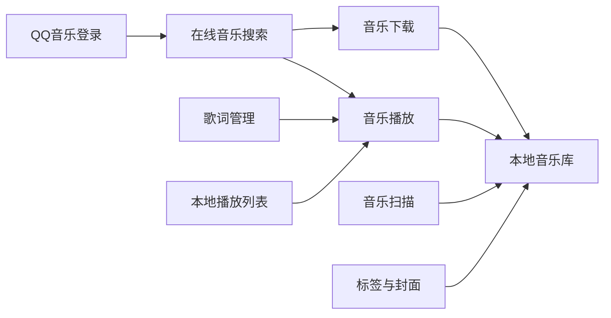
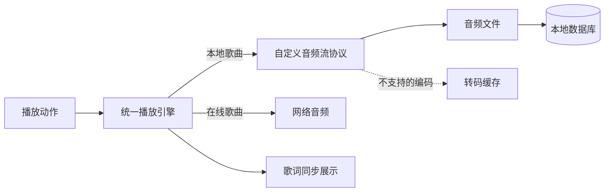
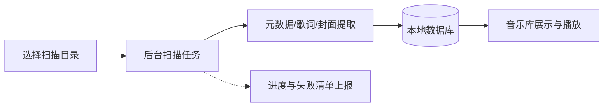

# LLMusic — 模块说明文档

> 本文档从业务功能视角说明系统的模块划分、端侧职责和协作关系。
> `doc/项目结构文档.md` 负责说明代码组织，本文档负责说明业务模块如何支撑产品能力。
> 更新日期：2026-08-15（校正音乐下载与本地音乐库的协作关系：下载仅落盘不自动入库，入库走元数据管理页的导入能力；同步补充本地音乐库的文件导入功能）
>
> **项目基础信息**：版本以依赖清单文件（`package.json`、`pyproject.toml`）为准。

| 端侧 | 技术栈 | 版本 | 用途 |
|------|--------|------|------|
| 桌面框架 | Electron | ^36.5.0 | 应用壳与主进程 |
| 前端框架 | Vue 3 | ^3.5.16 | 界面渲染 |
| 状态管理 | Pinia | ^3.0.3 | 前端状态管理 |
| 构建工具 | Vite | ^6.3.5 | 前端构建 |
| 样式 | Tailwind CSS | ^4.2.4 | 样式体系 |
| 语言 | TypeScript | ^5.9.3（前端）/ ^6.0.3（主进程） | 类型安全 |
| HTTP 客户端 | axios | ^1.16.0 | 前端请求后端 |
| 虚拟滚动 | vue-virtual-scroller | 2.0.0-beta.8 | 大列表渲染 |
| 图标 | Font Awesome | 4.7.0 | 图标体系 |
| 本地数据库 | better-sqlite3 | ^12.2.0 | 本地数据持久化 |
| 元数据解析 | music-metadata | ^11.2.3 | 音频标签与封面解析 |
| 标签写入 | node-id3 | ^0.2.9 | MP3 标签写入 |
| 音频转码 | fluent-ffmpeg / ffmpeg-static / ffprobe-static | ^2.1.3 / ^5.2.0 / ^3.1.0 | 格式转码、FLAC 标签写入 |
| 后端框架 | FastAPI | 版本未固定 | 在线业务 API |
| 后端运行 | Uvicorn | 版本未固定 | ASGI 服务 |
| 后端支撑 | pydantic-settings / httpx | 版本未固定 | 配置管理 / 出站请求 |
| QQ 音乐 SDK | qqmusic-api-python | 版本未固定 | 搜索、下载、登录、凭证刷新 |
| 运行语言 | Python | >=3.11 | 后端 |
| 打包 | PyInstaller | >=6.0.0 | 后端子进程打包 |

---

## 1. 文档定位

本文档面向参与 LLMusic 开发的开发者，帮助理解系统的业务功能设计、各模块的职责边界以及典型业务流程。与 `doc/项目结构文档.md` 的分工：结构文档只提供代码文件索引，本文档解释业务模块如何支撑产品能力。阅读建议：先通读第 2-4 节建立整体认知，再按需查阅第 5 节的具体模块说明，最后结合第 7-8 节理解模块间的协作与典型闭环。

## 2. 系统功能定位

LLMusic 是一个**桌面本地音乐播放器**，同时提供**在线音乐发现、歌单浏览与下载**能力。系统围绕以下核心能力方向设计：

| 能力方向 | 业务目标 | 用户价值 |
|---------|---------|---------|
| 本地音乐管理 | 组织、浏览、管理本地音频文件 | 建立个人音乐库 |
| 在线音乐发现 | 搜索 QQ 音乐曲库、获取下载链接 | 扩展音乐收藏 |
| 在线歌单浏览 | 查看账号歌单与喜欢列表、整单播放 | 延续在线听歌习惯 |
| 音乐播放体验 | 高质量音频播放、歌词同步、播放模式控制 | 沉浸式听歌 |
| 歌单与收藏 | 创建和管理本地播放列表 | 按主题组织音乐 |
| 元数据维护 | 编辑歌曲标签、管理封面 | 保持音乐库整洁 |

## 3. 端侧职责划分

| 端侧 | 职责定位 | 设计关注点 |
|------|---------|-----------|
| Electron 主进程 | 桌面壳层、IPC 桥接、本地数据持久化、自定义音频流协议与转码、文件系统操作、后端子进程生命周期管理 | 窗口生命周期、进程管理、数据一致性、路径安全校验、退出清理 |
| Vue 渲染进程（TypeScript） | UI 渲染、用户交互、状态管理、统一音频引擎、在线 API 调用 | 组件化、类型安全、状态响应式、体验流畅度 |
| FastAPI 后端 | 在线音乐业务逻辑层，封装 QQ 音乐 SDK 能力并标准化输出 | 接口幂等性、错误码统一、凭证管理、全局异常兜底 |
| 本地数据库（SQLite） | 单文件数据库（WAL 模式），存储歌曲、音乐库、播放列表、设置 | 读写性能、数据完整性（无迁移设计，旧格式数据自动清理） |
| QQ 音乐 SDK | 外部 SDK，提供 QQ 音乐搜索、下载、登录、凭证刷新等底层能力 | SDK 版本兼容、异常隔离 |
| 外部运行时 | 后端子进程（打包后随应用分发）、ffmpeg 转码工具 | 启动就绪等待、失败降级、资源释放 |

## 4. 功能模块总览

| 模块 | 定位 | 核心产出 | 依赖关系 |
|------|------|---------|---------|
| 本地音乐库 | 本地音频文件的组织与检索 | 歌曲列表、多库管理、搜索过滤 | 依赖音乐扫描、标签与封面；被音乐播放、本地播放列表依赖 |
| 在线音乐搜索 | QQ 音乐曲库的发现与获取入口 | 关键词搜索、链接解析、歌曲结果展示 | 依赖 QQ 音乐登录；供音乐下载、音乐播放使用 |
| QQ 音乐歌单 | 账号歌单的浏览与使用 | 歌单列表、歌单详情、整单播放、批量下载 | 依赖 QQ 音乐登录；复用音乐播放、音乐下载 |
| 音乐下载 | 从在线曲库获取音频文件到本地 | 单曲/批量保存、元数据嵌入 | 依赖在线音乐搜索、QQ 音乐歌单；供本地音乐库经导入能力入库 |
| QQ 音乐登录 | 在线服务的使用权限管理 | 二维码登录、凭证持久化与自动刷新 | 被全部在线模块依赖 |
| 音乐播放 | 核心听歌体验 | 统一播放引擎、播放模式、媒体会话、会话恢复 | 依赖本地音乐库、歌词管理；被各业务模块调用 |
| 歌词管理 | 歌词获取与同步展示 | 多来源歌词、格式解析、沉浸式歌词页 | 依赖标签与封面（写回联动）；被音乐播放依赖 |
| 本地播放列表 | 歌曲的主题组织 | 歌单 CRUD、歌曲分配、整单播放 | 依赖本地音乐库、音乐播放 |
| 音乐扫描 | 本地文件的入库 | 增量目录扫描、元数据解析、进度与失败上报 | 依赖本地数据库；供本地音乐库入库 |
| 标签与封面 | 歌曲元数据维护 | 标签编辑、封面提取与替换、缓存 | 依赖本地数据库；被音乐扫描、歌词管理依赖 |
| 窗口与 UI 壳 | 应用窗口与界面容器 | 窗口控制、侧边栏、统一歌曲表格、播放控制栏、后端服务管理 | 依赖全局通知、音乐播放；被所有页面依赖 |
| 全局通知 | 用户操作反馈 | Toast 提示、错误分类文案、登录状态联动 | 被所有模块依赖 |
| 系统设置 | 用户偏好持久化 | 关闭行为、展示偏好、性能模式 | 被窗口与 UI 壳、歌词管理依赖 |

## 5. 各业务模块说明

### 5.1 本地音乐库

**定位**：系统的数据核心层，解决"用户如何组织、浏览自己的音乐"这一需求，是所有本地音乐功能的底座。

**核心功能**：
- 多音乐库管理：创建、切换多个音乐库，歌曲按库组织
- 文件导入入库：从本地磁盘选择音频文件直接导入（下载到本地的歌曲可经此能力入库）
- 歌曲浏览与检索：按当前库加载歌曲，支持关键词搜索过滤、按属性排序
- 歌曲导入与删除：删除时校验文件关联，避免误删
- 播放计数维护
- 大列表体验：虚拟滚动渲染恒定 DOM 节点，封面经受限并发队列异步加载、失败结果缓存，避免无封面歌曲反复解析文件
- 启动时校验库内文件是否仍存在

**设计边界**：只管理歌曲元数据与归属关系，不负责文件扫描（归音乐扫描模块）、不负责音频解码（归音乐播放模块）。

**依赖与协作**：
- 依赖音乐扫描（入库）、标签与封面（元数据补充）
- 被音乐播放（取歌曲数据）、本地播放列表（取歌曲数据）依赖

**开发关注点**：
- 按库加载必须带请求去重与竞态保护，切换音乐库时旧请求不得覆盖新结果
- 封面加载走受限并发队列，失败结果按组件生命周期缓存并在卸载时清理
- 新增大列表展示场景时优先复用统一歌曲表格的虚拟滚动能力

### 5.2 在线音乐搜索

**定位**：连接 QQ 音乐曲库的发现入口，提供关键词和分享链接两种搜索方式，让用户找到想听的歌。

**核心功能**：
- 关键词搜索：分页浏览搜索结果，翻页结果缓存，回看已翻页面秒开
- 分享链接解析：粘贴歌曲或歌单链接，自动识别目标类型并加载
- 搜索体验优化：翻页先出骨架屏，封面与试听地址异步补全，不阻塞页面
- 专辑封面获取、在线试听入口

**设计边界**：
- 搜索结果统一在"发现音乐"页面展示
- 搜索结果只提供试听与下载所需的地址，不触发下载动作
- 试听质量受登录状态影响：无凭证时仅提供低码率试听

**依赖与协作**：
- 依赖 QQ 音乐登录（凭证）
- 被音乐下载（下载地址）、音乐播放（在线试听）依赖

**开发关注点**：
- 分页缓存与请求竞态需成对处理，防止旧页响应覆盖新页
- 新增音乐平台时遵循平台注册配置与统一 API 入口，不另起请求通道

### 5.3 QQ 音乐歌单

**定位**：把用户在 QQ 音乐账号下的歌单资源带入桌面端，延续其在线听歌习惯。

**核心功能**：
- 用户歌单列表：侧边栏展示账号创建的歌单与"我喜欢"列表，未登录时提示登录
- 歌单详情：加载歌单全部歌曲，支持歌单内按歌曲名/歌手筛选
- 整单播放（随机模式下随机起点）、单曲点击即播并进入歌词页
- 单曲下载与批量下载（含失败重试）
- 歌单刷新与加载失败重试

**设计边界**：只读浏览账号在线歌单，不提供在线歌单的编辑能力；歌单歌曲为远程数据，播放前需获取试听地址。

**依赖与协作**：
- 依赖 QQ 音乐登录（凭证与歌单数据）
- 复用统一歌曲表格（在线模式）、音乐播放、音乐下载能力

**开发关注点**：
- 切换歌单时清理搜索词与选中集，防止旧歌单数据串场
- 全量加载歌单时保证分页迭代完整性，避免丢曲

### 5.4 音乐下载

**定位**：把在线音频保存到用户本地磁盘并自动写入元数据，解决"如何把在线音乐变成本地收藏"的需求。

**核心功能**：
- 单曲下载与批量下载，逐曲进度跟踪（排队/下载中/成功/失败）
- 主进程侧独立并发限流与失败自动重试，不依赖渲染层限流
- 流式写盘避免大文件占用内存，临时文件随机命名防冲突
- 元数据嵌入：MP3 写入标签（含歌词与封面），FLAC 写入 Vorbis 注释与封面
- 元数据写入失败时降级保留纯音频文件，并向用户提示警告
- 文件导入入库（位于元数据管理入口），下载到本地的歌曲经此能力加入音乐库
- 文件名防路径逃逸校验，目标文件安全落盘

**设计边界**：
- 不参与下载地址的获取（由在线搜索、QQ 音乐歌单模块提供）
- 下载只负责把文件落盘到用户指定位置，不自动写入本地音乐库
- 元数据包由后端一次性聚合返回（详情、封面、歌词、下载链接并行组装）

**依赖与协作**：
- 依赖在线音乐搜索、QQ 音乐歌单（下载地址与元数据）
- 下载完成的文件经本地音乐库的文件导入能力入库

**开发关注点**：
- 主进程侧必须独立限流与重试，渲染层限流仅作体验优化
- 元数据写入失败必须降级保留音频而非丢弃文件
- 新增音频格式时同步维护标签写入与转码链路

### 5.5 QQ 音乐登录

**定位**：管理 QQ 音乐登录认证，为所有在线模块提供凭证支持。

**核心功能**：
- 二维码登录：创建登录会话、轮询扫码状态
- 凭证持久化：凭证写盘采用原子写，读盘带变更缓存（文件未变化不重复解析）
- 凭证自动刷新：应用启动时与登录状态查询时触发刷新，刷新成功后全局生效并落盘
- 登录状态联动：业务层识别未登录/凭证过期错误码时，前端登录状态自动复位
- 退出登录

**设计边界**：只管理凭证生命周期，不参与具体业务请求；凭证是全部在线功能的准入条件。

**依赖与协作**：被在线音乐搜索、QQ 音乐歌单、音乐下载等全部在线模块依赖。

**开发关注点**：
- 凭证读写注意原子性与并发安全，客户端实例重建需全局一致
- 新增在线能力前先确认其凭证依赖与未登录降级策略

### 5.6 音乐播放

**定位**：核心播放引擎，本地与在线歌曲使用同一套统一引擎，是全部听歌体验的中枢。

**核心功能**：
- 播放/暂停/seek、音量调节、播放模式切换（顺序/随机/单曲循环）
- 本地歌曲播放：经自定义音频流协议按区间分段传输，不支持的编码自动转码并按文件内容缓存复用
- 在线歌曲播放：直接加载网络音频地址
- 播放进度按固定间隔上报，支撑歌词逐字高亮
- 系统媒体会话集成：媒体键控制、锁屏封面展示
- 会话恢复：应用启动后恢复上次播放的歌曲与位置
- 播放错误统一捕获、进入统一错误状态并经通知反馈

**设计边界**：不负责文件扫描与下载；本地与在线仅音源地址不同，引擎与状态完全统一。

**依赖与协作**：
- 依赖本地音乐库（歌曲数据）、歌词管理（进度同步展示）
- 被在线音乐搜索、QQ 音乐歌单、本地播放列表、窗口与 UI 壳（播放控制栏）调用

**开发关注点**：
- 播放状态必须收编进统一状态管理，禁止新增全局可变变量
- 新增本地音频格式时确认转码链路覆盖，避免播放黑屏无反馈

### 5.7 歌词管理

**定位**：歌词的获取、解析与同步展示，支持标准 LRC、带时间轴 JSON 和纯文本格式，并提供沉浸式歌词页。

**核心功能**：
- 多来源歌词获取：内嵌标签歌词 → 同目录歌词文件 → 纯文本兜底；数据库歌词丢失时间戳时，播放时自动从音频文件重新提取带时间戳的歌词
- 多格式解析：标准 LRC 时间戳、同时间戳多行合并（翻译/罗马音）、逐字歌词时间轴
- 解析结果按歌曲缓存，标签写回改写歌词时联动失效
- 歌词页沉浸式展示：全屏滚动歌词 + 黑胶唱片风格封面动画（旋转唱盘、声波波纹、旋转渐变光边、扫光、浮动粒子、声波条、封面取色驱动光晕）
- 动画自适应：性能模式关闭装饰动画、页面隐藏暂停动画、系统减弱动态效果偏好自动降级

**设计边界**：歌词存储优先保留原始文本格式，不主动改写；存量纯文本歌词在播放时自动重新提取，无需重新扫描音乐库。

**依赖与协作**：
- 被音乐播放依赖（进度驱动同步展示）
- 依赖标签与封面（标签写回后的缓存失效联动）

**开发关注点**：
- 歌词缓存失效必须与标签写回联动，避免展示过期歌词
- 新增歌词格式时在统一提取与解析链路内扩展，不散落实现

### 5.8 本地播放列表

**定位**：歌曲的主题组织工具，支持用户创建、管理多个本地播放列表。

**核心功能**：
- 歌单创建、编辑、删除、排序
- 歌曲添加与移除，歌单内顺序维护
- 歌单歌曲加载：优先复用内存缓存，未命中部分并行查询
- 歌单整体播放

**设计边界**：只管理本地歌单，与 QQ 音乐在线歌单相互隔离。

**依赖与协作**：
- 依赖本地音乐库（歌曲数据）、音乐播放（整单播放）

**开发关注点**：
- 歌曲顺序由关联数据维护，调整操作注意顺序一致性
- 歌单数据变更后及时刷新内存缓存，避免脏读

### 5.9 音乐扫描

**定位**：将用户本地磁盘中的音频文件扫描入库，解析元数据并提取歌曲信息。

**核心功能**：
- 目录递归遍历，支持常见音频格式，按批次并行解析并实时上报进度
- 增量扫描：文件未变化（mtime 一致）跳过解析，复用已有记录
- 元数据解析：标题、艺术家、专辑、时长、码率、采样率、格式、年份、流派、音轨号、碟片号
- 歌词提取：按内嵌标签 → 同目录歌词文件 → 纯文本的优先级提取并入库
- 封面标记：识别嵌入式封面图片
- 后台线程执行，支持取消；取消后已解析的歌曲仍入库
- 失败文件收集：单个文件解析失败不中断扫描，失败清单随结果上报前端展示

**设计边界**：只读文件元数据，不修改源文件内容；扫描结果直接入库，不保留中间状态。

**依赖与协作**：
- 依赖本地数据库（写入）
- 供本地音乐库（入库后展示）依赖

**开发关注点**：
- 扫描任务带代次校验，延迟的超时/清理回调必须校验代次匹配，防止误伤新任务
- 扩展支持格式时同步维护扩展名清单与解析链路

### 5.10 标签与封面

**定位**：歌曲元数据的查看与编辑，支持封面提取与替换。

**核心功能**：
- 标签读取与编辑（标题、艺术家、专辑等）
- 封面图片提取与替换
- 歌词标签写入（与歌词管理联动）
- 封面读取缓存：按累计字节数淘汰并记录"确认无封面"负缓存，避免无封面歌曲反复整文件解析
- 缓存失效联动：标签写回可能改写歌词时触发歌词缓存失效

**设计边界**：只处理单文件元数据，不做批量改写；文件路径类操作全部经过安全校验。

**依赖与协作**：
- 被音乐扫描（封面/歌词提取）、歌词管理（写回联动）、本地音乐库（展示）依赖

**开发关注点**：
- 所有文件路径入参必须经过统一安全校验（绝对路径 + 扩展名白名单、文件名防逃逸）
- 无封面歌曲必须走负缓存，避免反复整文件解析

### 5.11 窗口与 UI 壳

**定位**：应用窗口容器与基础 UI 框架，承载页面切换、播放控制栏与后端服务管理。

**核心功能**：
- 无边框窗口控制（最小化/最大化/关闭）、侧边栏导航（可折叠、可调宽）、标题栏、系统托盘、单实例锁（二次启动聚焦已有窗口）
- 后端服务生命周期管理：启动后端子进程、健康检查等待就绪、退出时优雅停止（超时强制终止）
- 统一歌曲表格：本地/在线双模式（本地模式含 IPC 封面队列、排序、右键菜单；在线模式含远程封面、格式列、批量勾选、骨架屏），全模式虚拟滚动，支持受控/非受控选择
- 播放控制栏：播放控制、进度/音量调节、封面展示、歌词入口、媒体会话，空闲自动收缩为紧凑模式，收缩态可拖拽定位（坐标钳制在视口内）
- 文件关联打开：命令行参数或系统文件关联打开音频文件时聚焦播放
- 窗口关闭行为（退出/最小化到托盘）、退出清理（IPC 卸载、扫描任务终止、托盘销毁、数据库关闭，全部幂等）
- macOS 惯例适配：关闭窗口仅隐藏，激活事件时窗口重建

**设计边界**：不承载业务逻辑，只提供容器、导航与交互框架；播放控制栏不直接持有音频引擎，全部经统一状态管理。

**依赖与协作**：
- 依赖全局通知（反馈）、音乐播放（控制栏状态）
- 被全部页面组件依赖

**开发关注点**：
- 窗口、托盘、IPC 等资源必须随退出路径清理，清理逻辑幂等可重入
- 新增页面时遵循统一视图切换与侧边栏注册机制
- 播放控制栏的交互状态与播放状态解耦，避免直接操作引擎实例

### 5.12 全局通知与错误反馈
**定位**：统一的用户操作反馈体系，取代原生弹窗，覆盖成功、错误、警告与信息四类场景。

**核心功能**：
- 通知队列：右上角堆叠展示，自动消失，短时间同文案去重
- 错误分类提示：未知错误分为网络、业务（携带错误码）、系统三类，给出对应文案
- 登录状态联动：识别未登录/凭证过期错误码时自动同步前端登录状态
- 页面级反馈：各页面错误态、空态、重试入口补齐；主进程侧降级警告（如下载元数据写入失败）透传为通知

**设计边界**：只负责反馈呈现，不处理业务逻辑。

**依赖与协作**：被所有模块依赖（统一反馈出口）。

**开发关注点**：
- 新增业务错误码时同步接入错误分类映射与登录状态联动
- 通知文案面向用户可理解，不暴露内部异常细节

### 5.13 系统设置
**定位**：管理用户的偏好配置并持久化。

**核心功能**：
- 窗口关闭行为配置（退出应用/最小化到托盘）
- 歌词页动画效果设置
- 性能模式开关（开启后歌词页关闭装饰性动画）
- 偏好数据的读写持久化

**设计边界**：只存储用户偏好，不涉及业务数据。

**依赖与协作**：被窗口与 UI 壳（关闭行为）、歌词管理（动画与性能模式）依赖。

**开发关注点**：
- 设置变更即时生效并持久化，新增偏好保持既有读写模式

## 6. 通用支撑能力

### 6.1 后端统一响应与异常处理

- **职责**：全部接口输出统一信封结构；三层异常兜底（业务异常 / 参数校验失败 / 未预期异常），业务异常携带错误码，未预期异常统一按内部错误响应并记录日志；错误码体系覆盖未登录、凭证过期、限流等在线业务场景。
- **使用原则**：业务代码抛出携带错误码的异常即可，由全局处理器统一转换，路由层不做局部兜底；日志使用统一格式，级别由配置驱动。
- **开发时应避免**：在路由中各自写 try/except 处理错误、绕过统一信封返回裸数据、错误码含义模糊或重复。

### 6.2 IPC 通信桥梁（主进程 ↔ 渲染进程）

- **职责**：通道常量集中声明，处理器统一注册并返回卸载函数供退出时清理；音频流播放不占用 IPC 通道，走自定义协议。
- **使用原则**：新增能力时在集中声明处注册通道，处理器注册与清理成对出现。
- **开发时应避免**：硬编码通道名字符串、注册后不随退出卸载导致泄漏。

### 6.3 状态管理（渲染进程）

- **职责**：类型化状态管理统一承载前端业务状态；播放状态全量收编进播放状态模块，全局通知走通知队列。
- **使用原则**：页面与组件通过状态模块读写数据，跨模块协作经状态模块中转。
- **开发时应避免**：新增全局可变变量、绕过状态模块直接互改其他模块内部状态。

### 6.4 统一组件体系

- **职责**：基础组件库（按钮、输入、弹窗、进度、通知等）与统一歌曲表格（本地/在线双模式、虚拟滚动、受控/非受控选择）。
- **使用原则**：新页面优先复用基础组件与统一歌曲表格，差异能力通过 props 开关配置。
- **开发时应避免**：为单个页面重造基础组件、绕过虚拟滚动直接渲染大列表、复制粘贴表格实现。

### 6.5 在线 API 客户端管理（后端）

- **职责**：QQ 音乐 SDK 客户端单例管理，并发安全获取；登录与凭证刷新后重建单例；应用关闭时统一释放。
- **使用原则**：所有在线业务经单例客户端访问，凭证变更走统一重建路径。
- **开发时应避免**：业务代码自行创建客户端实例、凭证变更后继续使用旧实例、退出时不释放资源。

### 6.6 路径与外部工具安全

- **职责**：文件系统相关入口统一安全校验（绝对路径 + 扩展名白名单、文件名防路径逃逸）；ffmpeg 转码工具封装为统一能力。
- **使用原则**：任何来自渲染层的文件路径入参必须先校验再落盘操作。
- **开发时应避免**：未校验路径直接进行文件操作、拼接不可信文件名、散落调用外部工具命令。

## 7. 模块间关键关系

### 7.1 模块依赖总览

```mermaid
flowchart LR
    A[QQ音乐登录] --> B[在线音乐搜索]
    B --> C[音乐下载]
    B --> D[音乐播放]
    C --> E[本地音乐库]
    D --> E
    F[音乐扫描] --> E
    G[标签与封面] --> E
    H[歌词管理] --> D
    I[本地播放列表] --> D
```

核心语义：登录凭证是所有在线能力的准入条件；在线获取的音频经下载落地后汇入本地音乐库，本地与在线最终统一由播放模块消费。

### 7.2 在线音乐业务闭环（搜索 → 试听/下载 → 本地化）

```mermaid
flowchart LR
    A[二维码登录] --> B[在线搜索/歌单浏览]
    B --> C{用户操作}
    C -->|试听| D[统一播放引擎]
    C -->|下载| E[流式下载与元数据写入]
    E --> F[本地音乐库]
    F --> D
    D --> G[歌词同步展示]
```

核心语义：在线资源两条消费路径——试听即时播放，下载则经本地音乐库沉淀后回归统一播放引擎。

### 7.3 本地音频播放链路

```mermaid
flowchart LR
    A[播放动作] --> B[统一播放引擎]
    B -->|本地歌曲| C[自定义音频流协议]
    C --> E[音频文件]
    E --> D[(本地数据库)]
    C -.->|不支持的编码| F[转码缓存]
    B -->|在线歌曲| G[网络音频]
    B --> H[歌词同步展示]
```

核心语义：本地播放按需分段传输，编码不兼容时转码缓存复用；在线播放直连网络地址，两条路径共享同一引擎与状态。

### 7.4 音乐扫描入库链路

```mermaid
flowchart LR
    A[选择扫描目录] --> B[后台扫描任务]
    B --> C[元数据/歌词/封面提取]
    C --> D[(本地数据库)]
    D --> E[音乐库展示与播放]
    B -.-> F[进度与失败清单上报]
```

核心语义：扫描在后台线程执行，解析结果直接入库，进度与失败清单实时反馈给用户，全程不阻塞界面。

## 8. 典型业务闭环

### 8.1 发现并下载一首新歌

1. 用户登录 QQ 音乐（无凭证时仅可低码率试听）
2. 在"发现音乐"页面输入关键词搜索，或粘贴分享链接解析
3. 浏览分页搜索结果，试听确认后点击下载
4. 后端一次性聚合返回下载元数据包（下载地址、封面、歌词、详情）
5. 主进程并发受限地流式下载音频文件，写入元数据（MP3 走标签写入 / FLAC 走转码工具写入 Vorbis 注释），失败时降级保留纯音频并提示
6. 下载完成后文件保存到用户指定位置；如需纳入音乐库，在元数据管理入口通过文件导入将歌曲加入
7. 用户可在本地音乐库中直接播放该歌曲，歌词同步展示

### 8.2 浏览并播放 QQ 音乐歌单

1. 登录后侧边栏展示账号歌单与"我喜欢"列表
2. 点击歌单进入详情页，加载全部歌曲，可按歌曲名/歌手筛选
3. 点击"播放全部"或单曲进入播放，播放过程中自动进入歌词页
4. 需要收藏时对单曲或勾选歌曲发起下载，下载文件保存到指定目录；如需入库，经文件导入能力加入本地音乐库

### 8.3 扫描本地音乐库并播放

1. 用户在本地音乐库选择扫描目录，后台任务开始递归扫描
2. 增量扫描跳过未变化的文件，进度与失败清单实时上报
3. 解析完成的歌曲入库并展示；播放时若歌词丢失时间戳，自动从音频文件重新提取
4. 用户点击歌曲经统一引擎播放，封面经受限并发队列加载

### 8.4 编辑歌曲标签与封面

1. 用户在元数据管理页面选择歌曲，读取并展示标签与封面
2. 修改标签或替换封面后写回音频文件，相关缓存联动失效
3. 若写回涉及歌词，歌词缓存同步失效，下次播放重新提取
4. 修改后的信息在音乐库与歌词页即时反映

## 9. 后续开发参考原则

1. 新增在线音乐平台时遵循平台注册配置与统一 API 入口，不另起请求通道。
2. 播放状态必须收编进统一状态管理，禁止新增全局可变变量。
3. 本地歌曲播放一律走自定义音频流协议，不为新场景另开播放通道。
4. 批量与后台任务（下载、扫描）在主进程侧独立限流并带代次校验，不信任渲染层约束。
5. 文件系统与路径类操作必须经过统一安全校验后再落盘。
6. 功能失败一律降级可用（如元数据写入失败保留音频、歌词缺失回退纯文本），并向用户明确反馈。
7. 新增业务错误码时同步接入全局错误分类与登录状态联动。
8. 缓存（歌词、封面、搜索分页）必须定义淘汰或失效策略，写回类操作联动失效。
9. 大列表与图片密集场景优先复用统一歌曲表格与受限并发队列，先测量再优化。
10. IPC 通道统一集中声明并随退出路径卸载，注册与清理成对出现。
